## <span style="font-family: Arial; font-weight:bold;font-size:1.9em;color:#0e92ea">Assignment 1: Cardio Good Fitness Data Exploration</span>

&nbsp;

<p align="center" style="font-family: Arial;color:#0e92ea;font-size:1em;">
The data is about customers of the treadmill product(s) of a retail store called <b>Cardio Good Fitness</b>. This Dashboards explores the CSV data provided, generate key business insights identifying customer profiles and recommendations on the actions the company could take when targeting new customers.
</p>

##  <span style="font-family: Arial; font-weight:bold;font-size:1.9em;color:#0e92ea"> Contents:</span>

<ol style="font-family: Arial;color:#0e92ea;font-size:1em;">
    <li>Overview</li>
    <li>Univariate Data Analysis</li>
    <li>Multivariate Data Analysis</li>
    <li>Conclusion and Recommendations</li>
</ol>

####  <span style="font-family: Arial; font-weight:bold;font-size:1.9em;color:#0e92ea"> Setup (Import Modules):


```python
import os
import pandas as pd
import numpy as np
import matplotlib.pyplot as plt
import seaborn as sns
import warnings
warnings.filterwarnings('ignore')                  # Ignore/Do not display warnings

sns.set(color_codes=False)                          # Displays charts with background colors
%matplotlib inline

main_data= pd.read_csv('CardioGoodFitness.csv');   # Load the data
```

####  <span style="font-family: Arial; font-weight:bold;font-size:1.9em;color:#0e92ea"> 1. Overview of The Data Attributes:

&nbsp;
    
<span style="font-family: Arial; font-weight:bold;font-size:1em;color:#0e92ea"> General Observations:
<ul>
    <li>The data is made up of 180 rows and 9 columns.</li>
    <li>6 columns contain discrete data and theother 3 categorial data.</li>
    <li>The data has no null values.</li>
    <li>Another noticeable difference is a higher average income and mileage for males as compared to females.</li>
</ul>


```python
main_data.head()
```


<div>
<style scoped>
    .dataframe tbody tr th:only-of-type {
        vertical-align: middle;
    }

    .dataframe tbody tr th {
        vertical-align: top;
    }

    .dataframe thead th {
        text-align: right;
    }
</style>
<table border="1" class="dataframe">
  <thead>
    <tr style="text-align: right;">
      <th></th>
      <th>Product</th>
      <th>Age</th>
      <th>Gender</th>
      <th>Education</th>
      <th>MaritalStatus</th>
      <th>Usage</th>
      <th>Fitness</th>
      <th>Income</th>
      <th>Miles</th>
    </tr>
  </thead>
  <tbody>
    <tr>
      <th>0</th>
      <td>TM195</td>
      <td>18</td>
      <td>Male</td>
      <td>14</td>
      <td>Single</td>
      <td>3</td>
      <td>4</td>
      <td>29562</td>
      <td>112</td>
    </tr>
    <tr>
      <th>1</th>
      <td>TM195</td>
      <td>19</td>
      <td>Male</td>
      <td>15</td>
      <td>Single</td>
      <td>2</td>
      <td>3</td>
      <td>31836</td>
      <td>75</td>
    </tr>
    <tr>
      <th>2</th>
      <td>TM195</td>
      <td>19</td>
      <td>Female</td>
      <td>14</td>
      <td>Partnered</td>
      <td>4</td>
      <td>3</td>
      <td>30699</td>
      <td>66</td>
    </tr>
    <tr>
      <th>3</th>
      <td>TM195</td>
      <td>19</td>
      <td>Male</td>
      <td>12</td>
      <td>Single</td>
      <td>3</td>
      <td>3</td>
      <td>32973</td>
      <td>85</td>
    </tr>
    <tr>
      <th>4</th>
      <td>TM195</td>
      <td>20</td>
      <td>Male</td>
      <td>13</td>
      <td>Partnered</td>
      <td>4</td>
      <td>2</td>
      <td>35247</td>
      <td>47</td>
    </tr>
  </tbody>
</table>
</div>


```python
nulls_series             = main_data.isna().sum()         # Get a series counting number of empty values for each column
nonnulls_series          = main_data.notnull().sum()      # Get a series counting number of non empty valuesfor each column 
column_datatypes         = main_data.dtypes               # Get a series containing data types for each column 

nulls_count_df = pd.concat(
    [nulls_series, nonnulls_series, column_datatypes],    # Combine the series created above into a dataframe.
    axis=1,                                               # Concatenate using columns as axis. 
    keys=["Nulls", "Non-Nulls", "Type"],                  # Add Columns as for the nulls and non-nulls values
    sort=True)

print("Rows x Columns = " + str(main_data.shape) + "\n")  # Print out the dimensions of the data frame
print(nulls_count_df)                                     # Display the nulls count table
```

    Rows x Columns = (180, 9)
    
                   Nulls  Non-Nulls    Type
    Age                0        180   int64
    Education          0        180   int64
    Fitness            0        180   int64
    Gender             0        180  object
    Income             0        180   int64
    MaritalStatus      0        180  object
    Miles              0        180   int64
    Product            0        180  object
    Usage              0        180   int64
    

 <span style="font-family: Arial; font-weight:bold;font-size:1.2em;color:#0e92ea"> Fix Data Types


```python
main_data['Product']=main_data['Product'].astype("category")
main_data['Gender']=main_data['Gender'].astype("category")
main_data['MaritalStatus']=main_data['MaritalStatus'].astype("category")
```


```python
main_data['Gender'].value_counts()                        # Count number of females and males in the dataset.
```


    Male      104
    Female     76
    Name: Gender, dtype: int64


```python
main_data.describe()
```


<div>
<style scoped>
    .dataframe tbody tr th:only-of-type {
        vertical-align: middle;
    }

    .dataframe tbody tr th {
        vertical-align: top;
    }

    .dataframe thead th {
        text-align: right;
    }
</style>
<table border="1" class="dataframe">
  <thead>
    <tr style="text-align: right;">
      <th></th>
      <th>Age</th>
      <th>Education</th>
      <th>Usage</th>
      <th>Fitness</th>
      <th>Income</th>
      <th>Miles</th>
    </tr>
  </thead>
  <tbody>
    <tr>
      <th>count</th>
      <td>180.000000</td>
      <td>180.000000</td>
      <td>180.000000</td>
      <td>180.000000</td>
      <td>180.000000</td>
      <td>180.000000</td>
    </tr>
    <tr>
      <th>mean</th>
      <td>28.788889</td>
      <td>15.572222</td>
      <td>3.455556</td>
      <td>3.311111</td>
      <td>53719.577778</td>
      <td>103.194444</td>
    </tr>
    <tr>
      <th>std</th>
      <td>6.943498</td>
      <td>1.617055</td>
      <td>1.084797</td>
      <td>0.958869</td>
      <td>16506.684226</td>
      <td>51.863605</td>
    </tr>
    <tr>
      <th>min</th>
      <td>18.000000</td>
      <td>12.000000</td>
      <td>2.000000</td>
      <td>1.000000</td>
      <td>29562.000000</td>
      <td>21.000000</td>
    </tr>
    <tr>
      <th>25%</th>
      <td>24.000000</td>
      <td>14.000000</td>
      <td>3.000000</td>
      <td>3.000000</td>
      <td>44058.750000</td>
      <td>66.000000</td>
    </tr>
    <tr>
      <th>50%</th>
      <td>26.000000</td>
      <td>16.000000</td>
      <td>3.000000</td>
      <td>3.000000</td>
      <td>50596.500000</td>
      <td>94.000000</td>
    </tr>
    <tr>
      <th>75%</th>
      <td>33.000000</td>
      <td>16.000000</td>
      <td>4.000000</td>
      <td>4.000000</td>
      <td>58668.000000</td>
      <td>114.750000</td>
    </tr>
    <tr>
      <th>max</th>
      <td>50.000000</td>
      <td>21.000000</td>
      <td>7.000000</td>
      <td>5.000000</td>
      <td>104581.000000</td>
      <td>360.000000</td>
    </tr>
  </tbody>
</table>
</div>


```python
main_data.describe(include=["category"])
```


<div>
<style scoped>
    .dataframe tbody tr th:only-of-type {
        vertical-align: middle;
    }

    .dataframe tbody tr th {
        vertical-align: top;
    }

    .dataframe thead th {
        text-align: right;
    }
</style>
<table border="1" class="dataframe">
  <thead>
    <tr style="text-align: right;">
      <th></th>
      <th>Product</th>
      <th>Gender</th>
      <th>MaritalStatus</th>
    </tr>
  </thead>
  <tbody>
    <tr>
      <th>count</th>
      <td>180</td>
      <td>180</td>
      <td>180</td>
    </tr>
    <tr>
      <th>unique</th>
      <td>3</td>
      <td>2</td>
      <td>2</td>
    </tr>
    <tr>
      <th>top</th>
      <td>TM195</td>
      <td>Male</td>
      <td>Partnered</td>
    </tr>
    <tr>
      <th>freq</th>
      <td>80</td>
      <td>104</td>
      <td>107</td>
    </tr>
  </tbody>
</table>
</div>


```python
main_data.groupby(['Gender']).mean() # Eplore mean by Gender for each column 
```


<div>
<style scoped>
    .dataframe tbody tr th:only-of-type {
        vertical-align: middle;
    }

    .dataframe tbody tr th {
        vertical-align: top;
    }

    .dataframe thead th {
        text-align: right;
    }
</style>
<table border="1" class="dataframe">
  <thead>
    <tr style="text-align: right;">
      <th></th>
      <th>Age</th>
      <th>Education</th>
      <th>Usage</th>
      <th>Fitness</th>
      <th>Income</th>
      <th>Miles</th>
    </tr>
    <tr>
      <th>Gender</th>
      <th></th>
      <th></th>
      <th></th>
      <th></th>
      <th></th>
      <th></th>
    </tr>
  </thead>
  <tbody>
    <tr>
      <th>Female</th>
      <td>28.565789</td>
      <td>15.394737</td>
      <td>3.184211</td>
      <td>3.026316</td>
      <td>49828.907895</td>
      <td>90.013158</td>
    </tr>
    <tr>
      <th>Male</th>
      <td>28.951923</td>
      <td>15.701923</td>
      <td>3.653846</td>
      <td>3.519231</td>
      <td>56562.759615</td>
      <td>112.826923</td>
    </tr>
  </tbody>
</table>
</div>


 <span style="font-family: Arial; font-weight:bold;font-size:1.2em;color:#0e92ea"> Set Up Dashboard Theme:


```python
"""
Set color palettes.
"""
default_color_palette = ["#03A9F4", "#FF6F00", "#0288D1", "#D50000", "#7C4DFF"]
gender_color_palette  = {"Female":"#E91E63", "Male":"#42A5F5"}
product_color_palette = {'TM798':"#4FC3F7", 'TM195':"#4CAF50",'TM498':"#E91E63"}
maritalcolorstatus_color_palette = {'Single':'#ff3d00', 'Partnered':'#00c853'}
stats_colors = {'Mean':'#D50000', 'Mode':'#FF3D00', 'Median':'#2962FF'}


sns.set_theme(
    context="notebook",                                            # Sets default size for charts. 
    font_scale=1.5,                                                # Default font size .
    style="darkgrid");                                             # Dashboard chart background style.

sns.set_palette(sns.color_palette(default_color_palette))          # Initialize defaultcolor palette for the notebook charts
```

####  <span style="font-family: Arial; font-weight:bold;font-size:1.9em;color:#0e92ea"> 2. Univariate Data Analysis:


<span style="font-family: Arial; font-weight:bold;font-size:1.2em;color:#0e92ea">2.1 Exploring Categorial Variables</span>
    
<span style="font-family: Arial; font-weight:bold;font-size:1em;color:#0e92ea"> Observations:
<ul>
    <li>Gender profiles are only divided into male and female.</li>
    <li>Cardio Good Fitness has only three products: TM195, TM498 and TM798</li>
    <li>The data shows a difference of 31% more male customers than female customers.</li>
    <li>Looks like there are some males who prefer threadmill TM798 more than other products</li>
    <li>Another observation is a higher number of married customers (both male and female)</li>
</ul>


```python
fig, axs = plt.subplots(
    nrows=1,                                                                # Number of rows of the grid
    ncols=3,                                                                # Number of columns of the grid.
    figsize=(15,5),                                                         # The size each figure
    constrained_layout=True)                                                # To avoid overlap between values

def plot_cartegorial_charts(ax, df_column_name):                            # Helperfunction, creates a count plot and puts it on the grid on the given axis
    ax = sns.countplot(                                                     # Create the count plot
        data=main_data,                                                     # Use the original data frame
        x=main_data[df_column_name],                                        # Use the column name passed in to get the series/values of that column
        hue="Gender",                                                       # Split the visual into Male and Female
        palette=gender_color_palette,                                       # Use gender specific colors (pink and blue)
        ax=ax)                                                              # Plot on the given axis 
    ax.set_title(df_column_name + ' Profile', fontsize=14)                  # Set the title of the chart. 
    ax.legend(loc='upper right')                                            # Put the legend of the chart on the top right.

categorial_data_column_names = ['Product', 'Gender', 'MaritalStatus']       # A list of categorial columns.
column_names_index = 0;                                                     # Index variable used to loop

for ax in axs.flat:                                                         # Go through every axis on the grid and plota chart on it.
    plot_cartegorial_charts(ax, categorial_data_column_names[column_names_index])
    column_names_index = column_names_index + 1
```


    
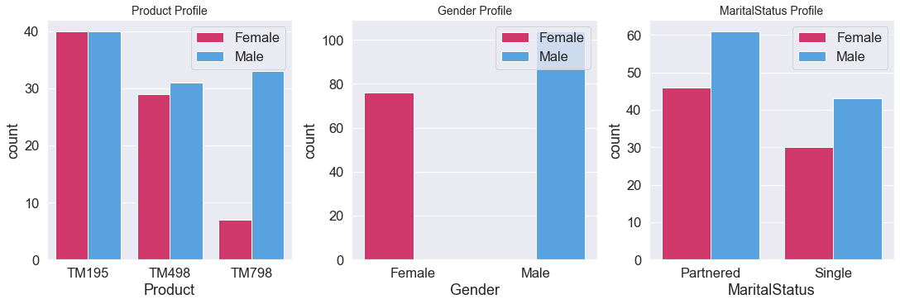
    


<span style="font-family: Arial; font-weight:bold;font-size:1.2em;color:#0e92ea">2.2 Exploring Continous Variables</span>
    
<span style="font-family: Arial; font-weight:bold;font-size:1em;color:#0e92ea"> Observations 1:
<ul>
    <li>Most of the customers are in their mid 20s and 30s.</li>
    <li>Most customers rate them selves on a fitnes score of 3.</li>
    <li>Most customers seem to be making around 40k and 60k in income.</li>
    <li>The average mile ran is around 100 Miles</li>
</ul>


```python
fig, (box, hist) = plt.subplots(
    nrows=2,                                                                # Number of rows of the grid
    ncols=3,                                                                # Number of columns of the grid.
    figsize=(15,4),       
            gridspec_kw={"height_ratios" : (0.25,0.7)},
    constrained_layout=True)                                                # To avoid overlap between values


def plot_distribution_chart(box_chart_ax, hist_chart_ax, df_column_name):   # Plot the probability density grap on the given axis
    
    sns.boxplot(
        data=main_data,
        x=main_data[df_column_name],
        showmeans=True,
        ax=box_chart_ax)
    
    sns.histplot(
        data=main_data,
        x=main_data[df_column_name],
        kde=True,
        ax=hist_chart_ax)
    
    hist_chart_ax.axvline(main_data[df_column_name].mean(),                 # Get the mean of the values in the given column and draw a vertical line that cuts the chart on the mean value 
               color=stats_colors['Mean'],                                  # Use on of the colors predefined on this notebook
               label='Mean',                                                # Set the label to be diplayed on the legend
               linestyle="dashed");                                         # Make the line have dashes
    
    hist_chart_ax.axvline(main_data[df_column_name].median(),               # Plot the median line on the chart.
               color=stats_colors['Median'],                                # Use on of the colors predefined on this notebook
               label='Median',                                              # Set the label to be diplayed on the legend
               linestyle="dashed");                                         # Make the line have dashes
    
    hist_chart_ax.axvline(main_data[df_column_name].mode()[0],              # Plot the mode line on the chart.
               color=stats_colors['Mode'],                                  # Use on of the colors predefined on this notebook 
               label='Mode',                                                # Set the label to be diplayed on the legend
               linestyle="dashed");                                         # Make the line have dashes
    
    hist_chart_ax.legend(bbox_to_anchor=(1.2, 1), loc='upper right')

column_names = ['Age', 'Income', 'Miles', 'Usage', 'Fitness', 'Education']

for count in range(3):
    plot_distribution_chart(box.flat[count], hist.flat[count], column_names[count])
    

fig, (box, hist) = plt.subplots(
    nrows=2,                                                                # Number of rows of the grid
    ncols=3,                                                                # Number of columns of the grid.
    figsize=(15,4),       
    gridspec_kw={"height_ratios" : (0.25,0.7)},
    constrained_layout=True) 

column_names = ['Usage', 'Fitness', 'Education']
for count in range(3):
    plot_distribution_chart(box.flat[count], hist.flat[count], column_names[count])
```


    
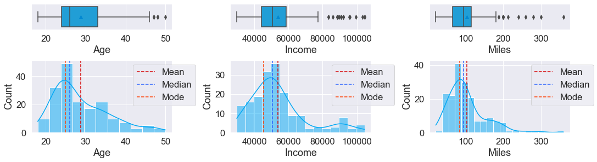
    


    
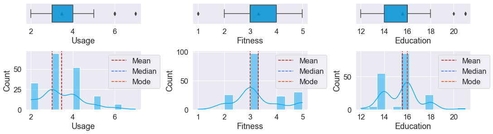
    


<span style="font-family: Arial; font-weight:bold;font-size:1em;color:#0e92ea"> Observations 2 (Same as 1):
<ul>
    <li>Most of the customers are in their mid 20s and 30s.</li>
    <li>Most customers rate them selves on a fitnes score of 3.</li>
    <li>Most customers seem to be making around 40k and 60k in income.</li>
    <li>The average mile ran is around 100 Miles</li>
</ul>


```python
fig, axs = plt.subplots(
    nrows=2,                                                                # Number of rows of the grid
    ncols=3,                                                                # Number of columns of the grid.
    figsize=(15,5),                                                         # The size each figure
    constrained_layout=True)                                                # To avoid overlap between values

def plot_box_chart(ax, df_column_name):                                     # Helper function to plot the violin plot.
    ax = sns.violinplot(                                                    # Plot the violin chart
        x=df_column_name,                                                   # Set the input column name as the x-axis
        data=main_data,                                                     # Use the main data loaded on start of the notebook
        ax = ax,                                                            # plot the violin on the given grid axis
        kind="box")                                                         # Use boxplot
    
    sns.stripplot(x=main_data[df_column_name],                              # Plot the stripplot show were most of the data in the violin lies
                  ax = ax,                                                  # Plot the violin on the given grid axis
                  color=default_color_palette[1],                           # use one the note-book'spredefined colors for the dots
                  jitter=True)                                              # Allows stripplot to visualize number of datapoints for a given x-axis 
    
    ax.axvline(main_data[df_column_name].mean(),                            # Plot the mean on the same axis as the violinplot. 
               color=default_color_palette[3],                              # Use one of the notebook's predeined colors
               label='Mean',                                                # Set the label to display on the legend
               linestyle="dashed");                                         # set the line style to have dashes.

    ax.set_xlabel(df_column_name)                                           # Set the x-axis label of the chart.                                           
    ax.set_title(df_column_name + ' Profile', fontsize=14)                  # Set the title of the chart
    ax.legend(loc='upper right')                                            # Move the legend to the upper right of the chart

continuous_data_column_names = ['Age', 'Income', 'Miles', 'Usage', 'Fitness', 'Education']
count =0
for ax in axs.flat:
    plot_box_chart(ax, continuous_data_column_names[count])
    count = count + 1
```


    
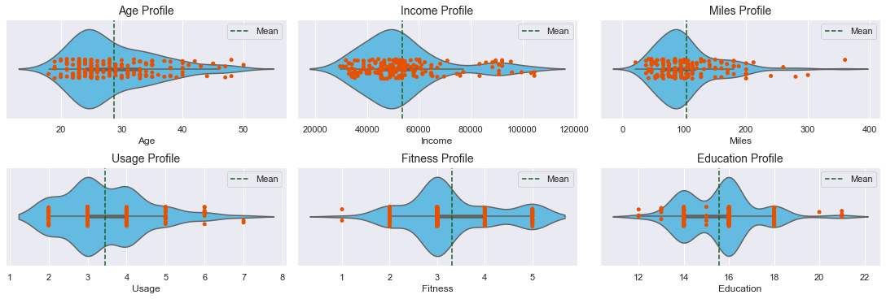
    


<span style="font-family: Arial; font-weight:bold;font-size:1em;color:#0e92ea"> Observations 3 (Comparing by Gender):
<ul>
    <li>Males tend use the products more than females.</li>
    <li>Males tend to run more miles than females.</li>
    <li>More males have a fitness score of 4-6 than females</li>
    <li>More males make more in income compared to females(might not be true since theres more males than females in the data</li>
    <li>Most of the customers are between ages 30 and 40</li>
</ul>


```python
fig, axs = plt.subplots(
    nrows=2,                                                                # Number of rows of the grid
    ncols=3,                                                                # Number of columns of the grid.
    figsize=(15,10),                                                        # The size each figure
    constrained_layout=True)                                                # To avoid overlap between values

def plot_distribution_chart(ax, df_column_name):
    ax = sns.kdeplot(main_data[df_column_name],
                     ax=ax,                                                 # Plot the kds chart on the given axis
                     palette=gender_color_palette,                          # Use gender specific colors defined at the start of this notebook
                     hue=main_data["Gender"],                               # Split the chart by gender
                     shade=True);                                           # Shaded the area below the curve
    
    ax.set_xlabel(df_column_name)                                           # Set the x-axis label of the chart.                                           
    ax.set_title(df_column_name + ' Profile', fontsize=14)                  # Set the title of the chart

    
continuous_data_column_names = ['Age', 'Income', 'Miles', 'Usage', 'Fitness', 'Education']
count =0
for ax in axs.flat:
    plot_distribution_chart(ax, continuous_data_column_names[count])
    count = count + 1
```


    
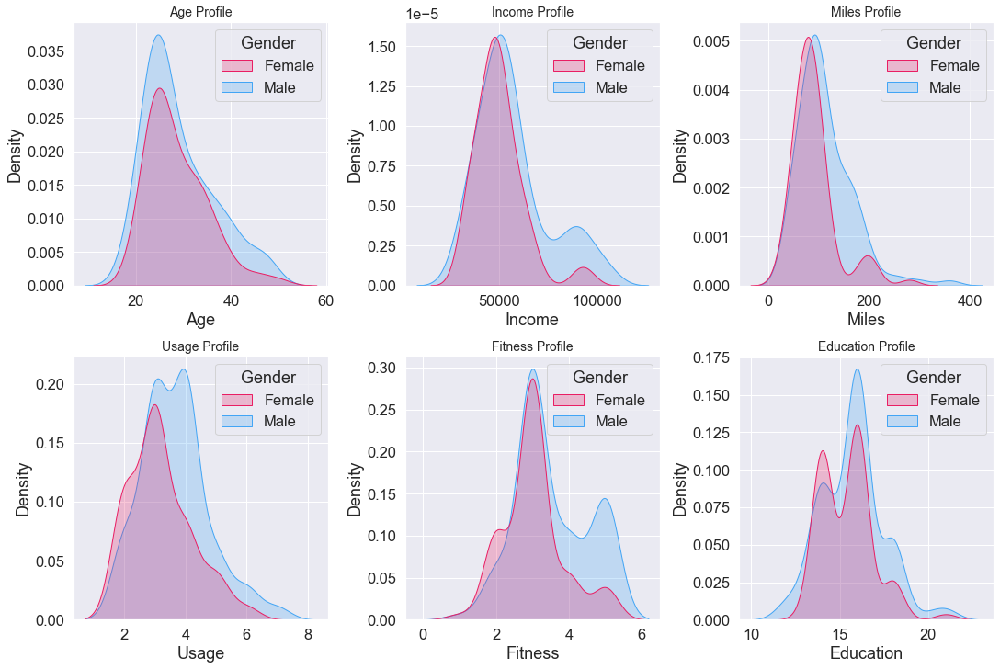
    


####  <span style="font-family: Arial; font-weight:bold;font-size:1.9em;color:#0e92ea"> 3. Multivariate Data Analysis:

<span style="font-family: Arial; font-weight:bold;font-size:1.2em;color:#0e92ea">3.1 Overview

<span style="font-family: Arial; font-weight:bold;font-size:1em;color:#0e92ea"> Observations (Comparing by Gender):
<ul>
    <li>The older the customer, the more them seem to be educated</li>
    <li>The average income for both male and female seem to be around 50k both being higher for older customers.</li>
    <li>There isnt that much correlation between the customer's age fitness (for both female and male)</li>
    <li>Theres a high correlation between high education and high income.</li>
    <li>Customers who want to use the machines more often tend to use them longer.</li>
    <li>Fitness tends to increase with usage.</li>
    <li>Males between ages 20 and 40 tend to earn (Income) more than females in the same age range.</li>
    <li>Males between ages 20 and 40 tend to run more miles than females in the same age range.</li>
    <li>Males between ages 20 and 40 tend to use the product more than females in the same age range.</li>
    <li>Males tend to run more than females with the same level of education.</li>
    <li>Theres positive corralation between income and usage for both males and females</li>
</ul>


```python
sns.pairplot(data=main_data, hue="Gender", kind="reg", palette=gender_color_palette);
```


    
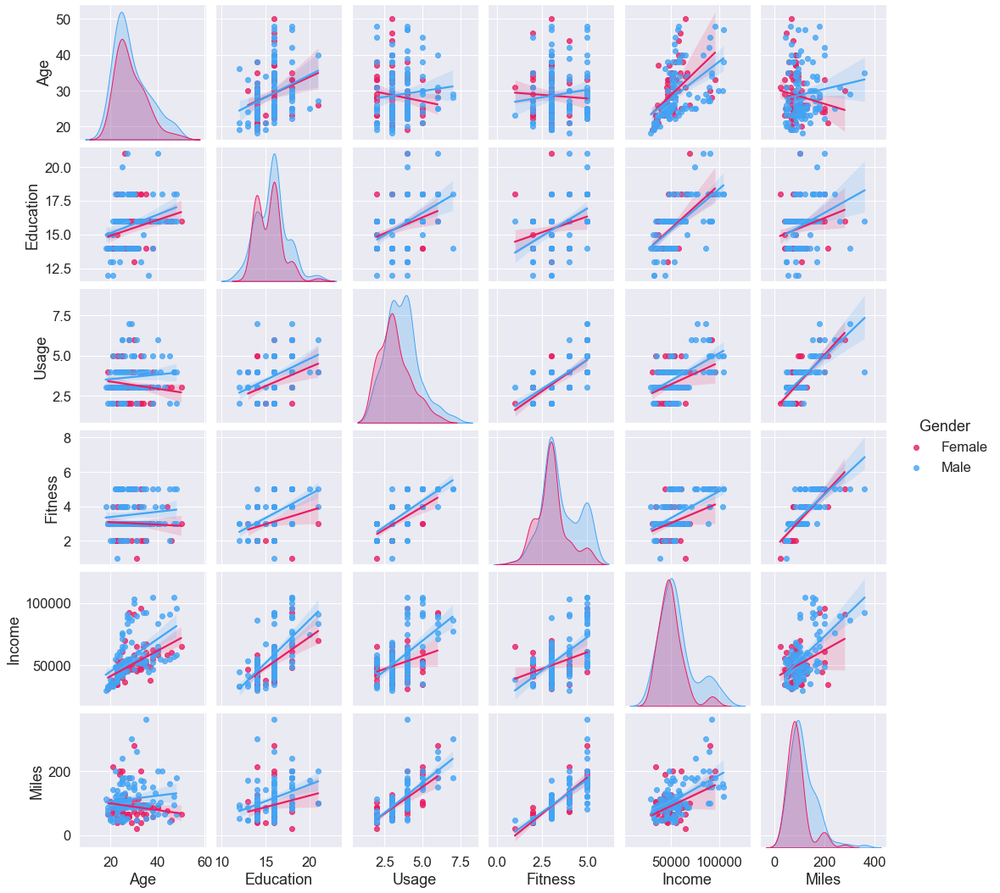
    


<span style="font-family: Arial; font-weight:bold;font-size:1em;color:#0e92ea"> Observations (Comparing by Gender):
<ul>
    <li>Product TM798 seesm to be more porpular amongest the higher educated, high earners, highly fit</li>
</ul>


```python
sns.pairplot(data=main_data, hue="Product", kind="reg", palette=product_color_palette);
```


    
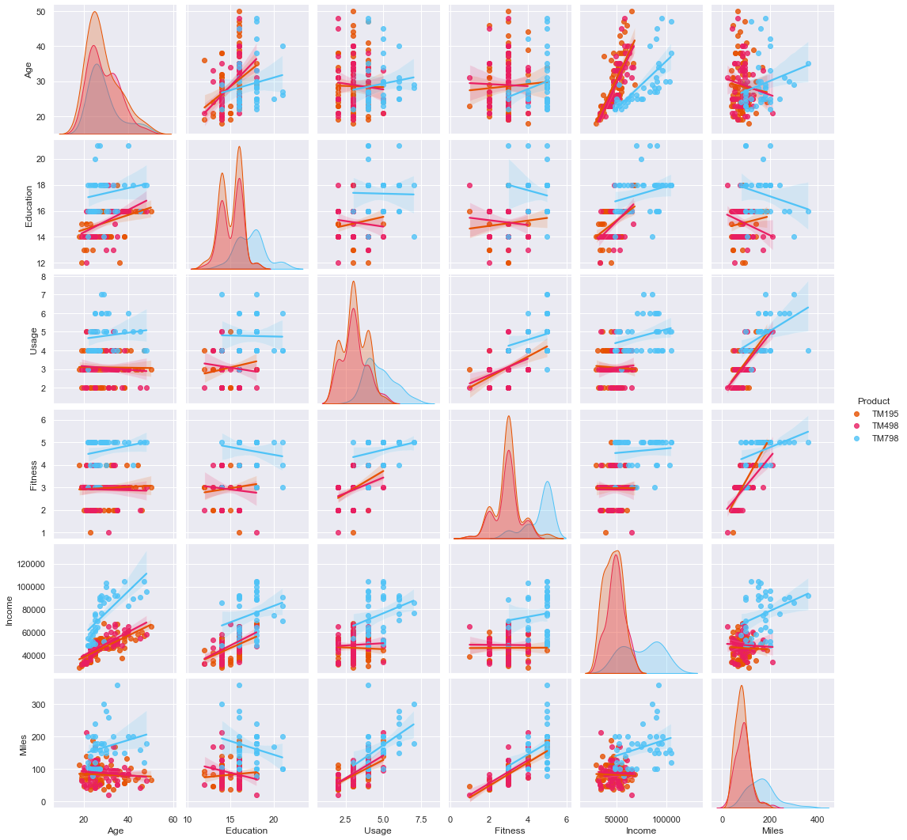
    


```python
sns.pairplot(data=main_data, hue="MaritalStatus", kind="reg", palette=maritalcolorstatus_color_palette);
```


    
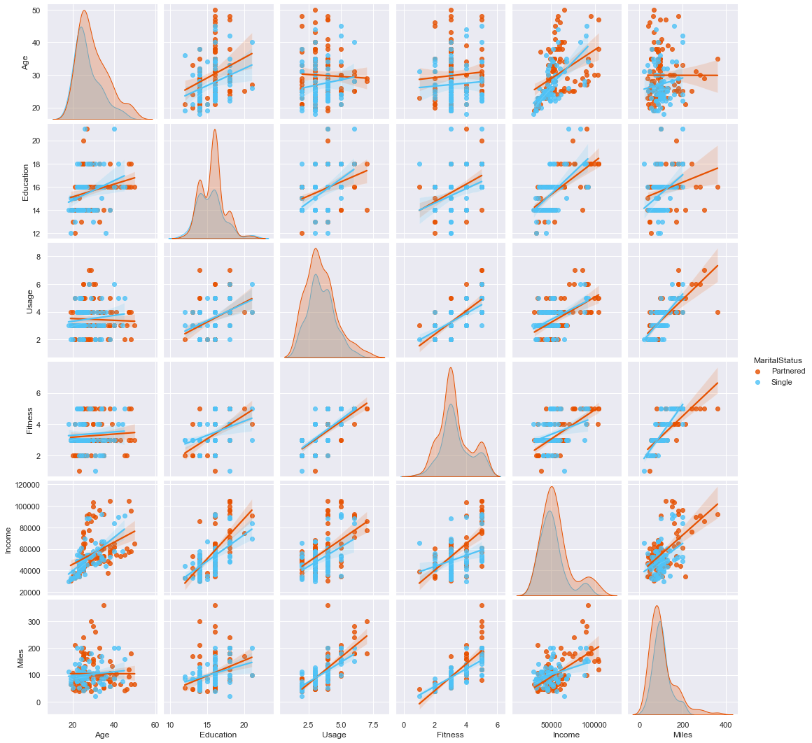
    


```python
fig, ax = plt.subplots(figsize=(18,18)) 
sns.heatmap(data=main_data.corr(), annot=True, linewidths=.5, ax=ax)
plt.show()
```


    
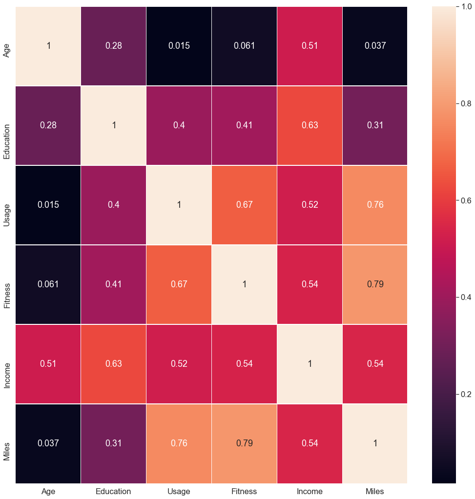
    


<span style="font-family: Arial; font-weight:bold;font-size:1em;color:#0e92ea"> Observations 2 (Product Drill):
<ul>
    <li>Here we see that morepeople in their 20s to 30s want to use TM789. This agerange is where most of the cusomter sample lies.</li>
</ul>


```python
fig, axs = plt.subplots(
    nrows=2,                                                                # Number of rows of the grid
    ncols=3,                                                                # Number of columns of the grid.
    figsize=(15,10),                                                        # The size each figure
    constrained_layout=True)                                                # To avoid overlap between values

def plot_product_comparison_boxplot(ax, df_column_name):
    
    ax = sns.boxplot(data=main_data,
                     x="Product",
                     y=df_column_name,
                     hue="Gender",
                     palette=gender_color_palette,
                     ax=ax);
    ax.legend(loc='upper right')                                            # Move the legend to the upper right of the chart
    
continuous_data_column_names = ['Age', 'Income', 'Miles', 'Usage', 'Fitness', 'Education']
count =0

for ax in axs.flat:
    plot_product_comparison_boxplot(ax, continuous_data_column_names[count])
    count = count + 1

plt.legend(loc='upper right')
plt.show()
```


    
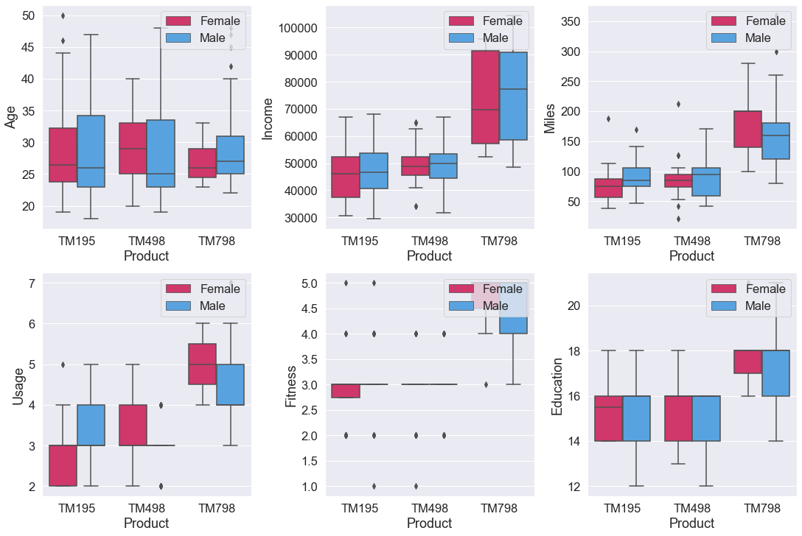
    


<span style="font-family: Arial; font-weight:bold;font-size:1em;color:#0e92ea"> Observations 2 (Product Drill):
<ul>
    <li>Married men seem to be earning higher than married women and non married customers</li>
</ul>


```python
fig, axs = plt.subplots(
    nrows=2,                                                                # Number of rows of the grid
    ncols=3,                                                                # Number of columns of the grid.
    figsize=(15,10),                                                        # The size each figure
    constrained_layout=True)                                                # To avoid overlap between values

def plot_marital_status_comparison_boxplot(ax, df_column_name):
    
    ax = sns.boxplot(data=main_data,
                     x="MaritalStatus",
                     y=df_column_name,
                     hue="Gender",
                     palette=gender_color_palette,
                     ax=ax);
    ax.legend(loc='upper right')                                            # Move the legend to the upper right of the chart

continuous_data_column_names = ['Age', 'Income', 'Miles', 'Usage', 'Fitness', 'Education']
count =0

for ax in axs.flat:
    plot_marital_status_comparison_boxplot(ax, continuous_data_column_names[count])
    count = count + 1

plt.legend(loc='upper right')
plt.show()
```


    
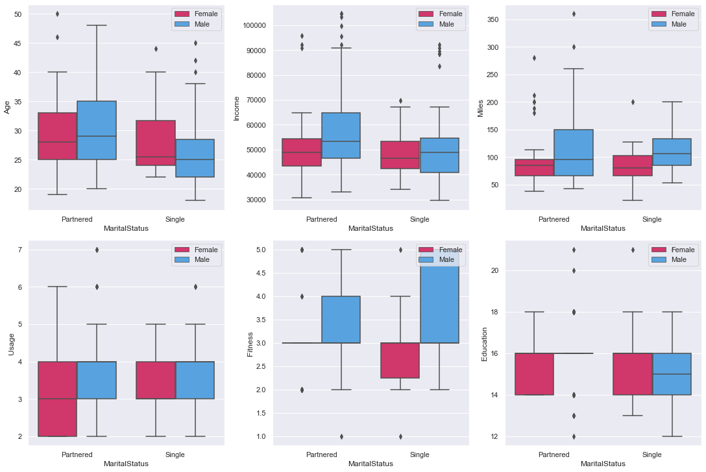
    


```python
fig, axs = plt.subplots(
    nrows=2,                                                                # Number of rows of the grid
    ncols=3,                                                                # Number of columns of the grid.
    figsize=(15,10),                                                        # The size each figure
    constrained_layout=True)                                                # To avoid overlap between values

def plot_marital_status_comparison_boxplot(ax, df_column_name):
    
    ax = sns.lineplot(data=main_data,
                     x=main_data['Age'],
                     y=main_data[df_column_name],
                     hue="Gender",
                     palette=gender_color_palette,
                     ci=0,
                     ax=ax);
    ax.legend(loc='upper right')                                            # Move the legend to the upper right of the chart
    
continuous_data_column_names = ['Miles', 'Usage', 'Fitness', 'Education', 'Product', 'MaritalStatus']
count =0

for ax in axs.flat:
    plot_marital_status_comparison_boxplot(ax, continuous_data_column_names[count])
    count = count + 1

plt.legend(loc='upper right')
plt.show()
```


    
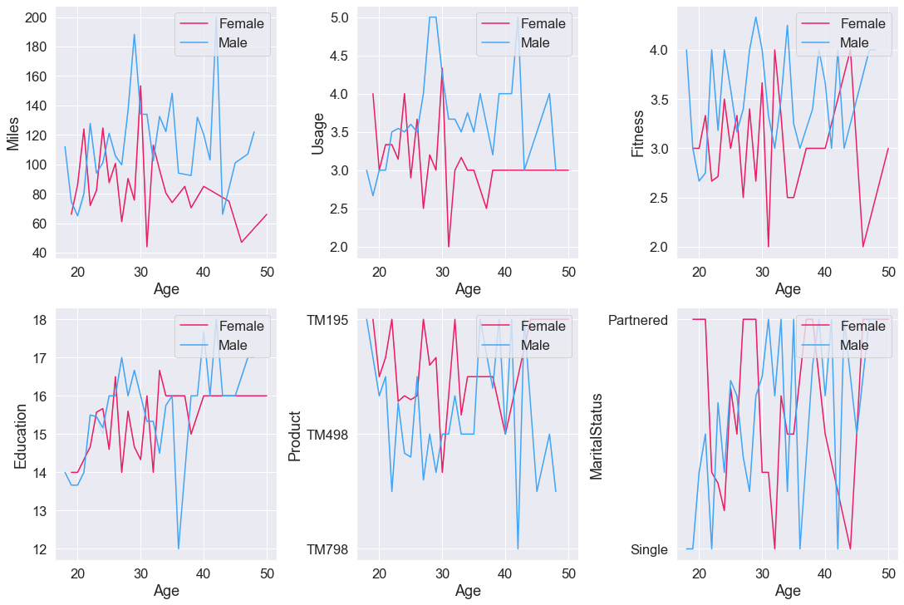
    


<span style="font-family: Arial; font-weight:bold;font-size:1.2em;color:#0e92ea">3.2 Group Data With Regards to Product


```python
main_data[main_data['Product']=='TM195'].describe(include="all")
```


<div>
<style scoped>
    .dataframe tbody tr th:only-of-type {
        vertical-align: middle;
    }

    .dataframe tbody tr th {
        vertical-align: top;
    }

    .dataframe thead th {
        text-align: right;
    }
</style>
<table border="1" class="dataframe">
  <thead>
    <tr style="text-align: right;">
      <th></th>
      <th>Product</th>
      <th>Age</th>
      <th>Gender</th>
      <th>Education</th>
      <th>MaritalStatus</th>
      <th>Usage</th>
      <th>Fitness</th>
      <th>Income</th>
      <th>Miles</th>
    </tr>
  </thead>
  <tbody>
    <tr>
      <th>count</th>
      <td>80</td>
      <td>80.000000</td>
      <td>80</td>
      <td>80.000000</td>
      <td>80</td>
      <td>80.000000</td>
      <td>80.00000</td>
      <td>80.00000</td>
      <td>80.000000</td>
    </tr>
    <tr>
      <th>unique</th>
      <td>1</td>
      <td>NaN</td>
      <td>2</td>
      <td>NaN</td>
      <td>2</td>
      <td>NaN</td>
      <td>NaN</td>
      <td>NaN</td>
      <td>NaN</td>
    </tr>
    <tr>
      <th>top</th>
      <td>TM195</td>
      <td>NaN</td>
      <td>Female</td>
      <td>NaN</td>
      <td>Partnered</td>
      <td>NaN</td>
      <td>NaN</td>
      <td>NaN</td>
      <td>NaN</td>
    </tr>
    <tr>
      <th>freq</th>
      <td>80</td>
      <td>NaN</td>
      <td>40</td>
      <td>NaN</td>
      <td>48</td>
      <td>NaN</td>
      <td>NaN</td>
      <td>NaN</td>
      <td>NaN</td>
    </tr>
    <tr>
      <th>mean</th>
      <td>NaN</td>
      <td>28.550000</td>
      <td>NaN</td>
      <td>15.037500</td>
      <td>NaN</td>
      <td>3.087500</td>
      <td>2.96250</td>
      <td>46418.02500</td>
      <td>82.787500</td>
    </tr>
    <tr>
      <th>std</th>
      <td>NaN</td>
      <td>7.221452</td>
      <td>NaN</td>
      <td>1.216383</td>
      <td>NaN</td>
      <td>0.782624</td>
      <td>0.66454</td>
      <td>9075.78319</td>
      <td>28.874102</td>
    </tr>
    <tr>
      <th>min</th>
      <td>NaN</td>
      <td>18.000000</td>
      <td>NaN</td>
      <td>12.000000</td>
      <td>NaN</td>
      <td>2.000000</td>
      <td>1.00000</td>
      <td>29562.00000</td>
      <td>38.000000</td>
    </tr>
    <tr>
      <th>25%</th>
      <td>NaN</td>
      <td>23.000000</td>
      <td>NaN</td>
      <td>14.000000</td>
      <td>NaN</td>
      <td>3.000000</td>
      <td>3.00000</td>
      <td>38658.00000</td>
      <td>66.000000</td>
    </tr>
    <tr>
      <th>50%</th>
      <td>NaN</td>
      <td>26.000000</td>
      <td>NaN</td>
      <td>16.000000</td>
      <td>NaN</td>
      <td>3.000000</td>
      <td>3.00000</td>
      <td>46617.00000</td>
      <td>85.000000</td>
    </tr>
    <tr>
      <th>75%</th>
      <td>NaN</td>
      <td>33.000000</td>
      <td>NaN</td>
      <td>16.000000</td>
      <td>NaN</td>
      <td>4.000000</td>
      <td>3.00000</td>
      <td>53439.00000</td>
      <td>94.000000</td>
    </tr>
    <tr>
      <th>max</th>
      <td>NaN</td>
      <td>50.000000</td>
      <td>NaN</td>
      <td>18.000000</td>
      <td>NaN</td>
      <td>5.000000</td>
      <td>5.00000</td>
      <td>68220.00000</td>
      <td>188.000000</td>
    </tr>
  </tbody>
</table>
</div>


```python
main_data[main_data['Product']=='TM498'].describe(include="all")
```


<div>
<style scoped>
    .dataframe tbody tr th:only-of-type {
        vertical-align: middle;
    }

    .dataframe tbody tr th {
        vertical-align: top;
    }

    .dataframe thead th {
        text-align: right;
    }
</style>
<table border="1" class="dataframe">
  <thead>
    <tr style="text-align: right;">
      <th></th>
      <th>Product</th>
      <th>Age</th>
      <th>Gender</th>
      <th>Education</th>
      <th>MaritalStatus</th>
      <th>Usage</th>
      <th>Fitness</th>
      <th>Income</th>
      <th>Miles</th>
    </tr>
  </thead>
  <tbody>
    <tr>
      <th>count</th>
      <td>60</td>
      <td>60.000000</td>
      <td>60</td>
      <td>60.000000</td>
      <td>60</td>
      <td>60.000000</td>
      <td>60.00000</td>
      <td>60.000000</td>
      <td>60.000000</td>
    </tr>
    <tr>
      <th>unique</th>
      <td>1</td>
      <td>NaN</td>
      <td>2</td>
      <td>NaN</td>
      <td>2</td>
      <td>NaN</td>
      <td>NaN</td>
      <td>NaN</td>
      <td>NaN</td>
    </tr>
    <tr>
      <th>top</th>
      <td>TM498</td>
      <td>NaN</td>
      <td>Male</td>
      <td>NaN</td>
      <td>Partnered</td>
      <td>NaN</td>
      <td>NaN</td>
      <td>NaN</td>
      <td>NaN</td>
    </tr>
    <tr>
      <th>freq</th>
      <td>60</td>
      <td>NaN</td>
      <td>31</td>
      <td>NaN</td>
      <td>36</td>
      <td>NaN</td>
      <td>NaN</td>
      <td>NaN</td>
      <td>NaN</td>
    </tr>
    <tr>
      <th>mean</th>
      <td>NaN</td>
      <td>28.900000</td>
      <td>NaN</td>
      <td>15.116667</td>
      <td>NaN</td>
      <td>3.066667</td>
      <td>2.90000</td>
      <td>48973.650000</td>
      <td>87.933333</td>
    </tr>
    <tr>
      <th>std</th>
      <td>NaN</td>
      <td>6.645248</td>
      <td>NaN</td>
      <td>1.222552</td>
      <td>NaN</td>
      <td>0.799717</td>
      <td>0.62977</td>
      <td>8653.989388</td>
      <td>33.263135</td>
    </tr>
    <tr>
      <th>min</th>
      <td>NaN</td>
      <td>19.000000</td>
      <td>NaN</td>
      <td>12.000000</td>
      <td>NaN</td>
      <td>2.000000</td>
      <td>1.00000</td>
      <td>31836.000000</td>
      <td>21.000000</td>
    </tr>
    <tr>
      <th>25%</th>
      <td>NaN</td>
      <td>24.000000</td>
      <td>NaN</td>
      <td>14.000000</td>
      <td>NaN</td>
      <td>3.000000</td>
      <td>3.00000</td>
      <td>44911.500000</td>
      <td>64.000000</td>
    </tr>
    <tr>
      <th>50%</th>
      <td>NaN</td>
      <td>26.000000</td>
      <td>NaN</td>
      <td>16.000000</td>
      <td>NaN</td>
      <td>3.000000</td>
      <td>3.00000</td>
      <td>49459.500000</td>
      <td>85.000000</td>
    </tr>
    <tr>
      <th>75%</th>
      <td>NaN</td>
      <td>33.250000</td>
      <td>NaN</td>
      <td>16.000000</td>
      <td>NaN</td>
      <td>3.250000</td>
      <td>3.00000</td>
      <td>53439.000000</td>
      <td>106.000000</td>
    </tr>
    <tr>
      <th>max</th>
      <td>NaN</td>
      <td>48.000000</td>
      <td>NaN</td>
      <td>18.000000</td>
      <td>NaN</td>
      <td>5.000000</td>
      <td>4.00000</td>
      <td>67083.000000</td>
      <td>212.000000</td>
    </tr>
  </tbody>
</table>
</div>


```python
main_data[main_data['Product']=='TM798'].describe(include="all")
```


<div>
<style scoped>
    .dataframe tbody tr th:only-of-type {
        vertical-align: middle;
    }

    .dataframe tbody tr th {
        vertical-align: top;
    }

    .dataframe thead th {
        text-align: right;
    }
</style>
<table border="1" class="dataframe">
  <thead>
    <tr style="text-align: right;">
      <th></th>
      <th>Product</th>
      <th>Age</th>
      <th>Gender</th>
      <th>Education</th>
      <th>MaritalStatus</th>
      <th>Usage</th>
      <th>Fitness</th>
      <th>Income</th>
      <th>Miles</th>
    </tr>
  </thead>
  <tbody>
    <tr>
      <th>count</th>
      <td>40</td>
      <td>40.000000</td>
      <td>40</td>
      <td>40.000000</td>
      <td>40</td>
      <td>40.000000</td>
      <td>40.000000</td>
      <td>40.00000</td>
      <td>40.000000</td>
    </tr>
    <tr>
      <th>unique</th>
      <td>1</td>
      <td>NaN</td>
      <td>2</td>
      <td>NaN</td>
      <td>2</td>
      <td>NaN</td>
      <td>NaN</td>
      <td>NaN</td>
      <td>NaN</td>
    </tr>
    <tr>
      <th>top</th>
      <td>TM798</td>
      <td>NaN</td>
      <td>Male</td>
      <td>NaN</td>
      <td>Partnered</td>
      <td>NaN</td>
      <td>NaN</td>
      <td>NaN</td>
      <td>NaN</td>
    </tr>
    <tr>
      <th>freq</th>
      <td>40</td>
      <td>NaN</td>
      <td>33</td>
      <td>NaN</td>
      <td>23</td>
      <td>NaN</td>
      <td>NaN</td>
      <td>NaN</td>
      <td>NaN</td>
    </tr>
    <tr>
      <th>mean</th>
      <td>NaN</td>
      <td>29.100000</td>
      <td>NaN</td>
      <td>17.325000</td>
      <td>NaN</td>
      <td>4.775000</td>
      <td>4.625000</td>
      <td>75441.57500</td>
      <td>166.900000</td>
    </tr>
    <tr>
      <th>std</th>
      <td>NaN</td>
      <td>6.971738</td>
      <td>NaN</td>
      <td>1.639066</td>
      <td>NaN</td>
      <td>0.946993</td>
      <td>0.667467</td>
      <td>18505.83672</td>
      <td>60.066544</td>
    </tr>
    <tr>
      <th>min</th>
      <td>NaN</td>
      <td>22.000000</td>
      <td>NaN</td>
      <td>14.000000</td>
      <td>NaN</td>
      <td>3.000000</td>
      <td>3.000000</td>
      <td>48556.00000</td>
      <td>80.000000</td>
    </tr>
    <tr>
      <th>25%</th>
      <td>NaN</td>
      <td>24.750000</td>
      <td>NaN</td>
      <td>16.000000</td>
      <td>NaN</td>
      <td>4.000000</td>
      <td>4.000000</td>
      <td>58204.75000</td>
      <td>120.000000</td>
    </tr>
    <tr>
      <th>50%</th>
      <td>NaN</td>
      <td>27.000000</td>
      <td>NaN</td>
      <td>18.000000</td>
      <td>NaN</td>
      <td>5.000000</td>
      <td>5.000000</td>
      <td>76568.50000</td>
      <td>160.000000</td>
    </tr>
    <tr>
      <th>75%</th>
      <td>NaN</td>
      <td>30.250000</td>
      <td>NaN</td>
      <td>18.000000</td>
      <td>NaN</td>
      <td>5.000000</td>
      <td>5.000000</td>
      <td>90886.00000</td>
      <td>200.000000</td>
    </tr>
    <tr>
      <th>max</th>
      <td>NaN</td>
      <td>48.000000</td>
      <td>NaN</td>
      <td>21.000000</td>
      <td>NaN</td>
      <td>7.000000</td>
      <td>5.000000</td>
      <td>104581.00000</td>
      <td>360.000000</td>
    </tr>
  </tbody>
</table>
</div>


####  <span style="font-family: Arial; font-weight:bold;font-size:1.9em;color:#0e92ea"> 4. Summary and Recommendations:
   
<p align="center">
Product TM798 seems be more used and and the business should consider stocking moreto avoid discouraging customers by having them wait for a vacant machine if they are all occupied.
</p>


```python
os.system('jupyter nbconvert --to markdown --output "README.md" "DataExplorationAssignment.ipynb"')
```


```python

```
