## <span style="font-family: Arial; font-weight:bold;font-size:1.9em;color:#0e92ea">Assignment 2: AirBnB</span>

&nbsp;

<p align="center" style="font-family: Arial;color:#0e92ea;font-size:1em;">
Exploring pricing models that can effectively predict the Rent for accommodation and can help hosts, travelers, and also the business in devising profitable strategies.
    
</p>

##  <span style="font-family: Arial; font-weight:bold;font-size:1.9em;color:#0e92ea"> Contents:</span>

<ol style="font-family: Arial;color:#0e92ea;font-size:1em;">
    <li>Data Overview</li>
    <li>EDA and Data Processing</li>
    <li>Outlier Treatment</li>
    <li>Model building and Evaluation</li>
    <li>Conclusions</li>
</ol>

####  <span style="font-family: Arial; font-weight:bold;font-size:1.9em;color:#0e92ea"> Setup (Import Modules):


```python
import os
import pandas as pd
import numpy as np
import matplotlib.pyplot as plt
from matplotlib import gridspec
import seaborn as sns
import warnings

from sklearn.model_selection import train_test_split
from sklearn.linear_model import LinearRegression
from sklearn.preprocessing import OneHotEncoder
from sklearn.metrics import mean_absolute_error, mean_squared_error, r2_score

warnings.filterwarnings('ignore')                                       # Ignore/Do not display warnings

main_data = pd.read_csv('AirBnB.csv')

pd.set_option('display.max_columns', None)
pd.set_option('display.max_rows', 500)

sns.set(color_codes=False)                                              # Displays charts with background colors
%matplotlib inline

default_color_palette = ["#03A9F4","#7C4DFF", "#FF5252", "#D50000", "#FF6F00", "#0288D1", "#7C4DFF"]
stats_colors = {'Mean':'#D50000', 'Mode':'#FF3D00', 'Median':'#2962FF'} # Set standard colors for mean, mode and median to use accross entire notebook
```

####  <span style="font-family: Arial; font-weight:bold;font-size:1.9em;color:#0e92ea"> 1. Data Overview:
    
<span style="font-family: Arial; font-weight:bold;font-size:1em;color:#0e92ea"> General Observations:
<ul>
    <li>The data is made up of 74111 rows and 11 columns.</li>
    <li>There isnt a big number of nulls so we can drop null rows.</li>
</ul>


```python
print(f"Rows : {main_data.shape[0]} x Columns : {main_data.shape[1]}")
```

    Rows : 74111 x Columns : 11
    


```python
'''
Input:
Pandas DataFrame

Output:
Displays DataFrame structure 
(columns, nulls and non nulls counts and percentage highlighing columns with most number of nulls)

Retunrs:
N/A
'''
def info(dataFrame):
    nulls_series             = dataFrame.isna().sum()         # Get a series counting number of empty values for each column
    nonnulls_series          = dataFrame.notnull().sum()      # Get a series counting number of non empty valuesfor each column 
    nulls_percentage         = ((nulls_series * 100)/(nulls_series + nonnulls_series)).astype(float)
    column_datatypes         = dataFrame.dtypes               # Get a series containing data types for each column 

    nulls_count_df = pd.concat(
        [nulls_series, nonnulls_series, nulls_percentage, column_datatypes],
        axis=1,
        keys=["Nulls", "Non-Nulls","Nulls %", "Type"], 
        sort=True)
    cm = sns.light_palette("red", as_cmap=True)
    display(nulls_count_df.style.background_gradient(cmap=cm, subset=pd.IndexSlice[:, ['Nulls %']]).format(formatter={('Nulls %'): "{:.2f}%"}))    
```


```python
info(main_data)
```


<style  type="text/css" >
#T_363e7_row0_col2,#T_363e7_row4_col2,#T_363e7_row5_col2,#T_363e7_row6_col2,#T_363e7_row7_col2,#T_363e7_row8_col2,#T_363e7_row10_col2{
            background-color:  #f3f0f0;
            color:  #000000;
        }#T_363e7_row1_col2{
            background-color:  #f3eded;
            color:  #000000;
        }#T_363e7_row2_col2{
            background-color:  #f3efef;
            color:  #000000;
        }#T_363e7_row3_col2{
            background-color:  #f3eeee;
            color:  #000000;
        }#T_363e7_row9_col2{
            background-color:  #ff0000;
            color:  #f1f1f1;
        }</style><table id="T_363e7_" ><thead>    <tr>        <th class="blank level0" ></th>        <th class="col_heading level0 col0" >Nulls</th>        <th class="col_heading level0 col1" >Non-Nulls</th>        <th class="col_heading level0 col2" >Nulls %</th>        <th class="col_heading level0 col3" >Type</th>    </tr></thead><tbody>
                <tr>
                        <th id="T_363e7_level0_row0" class="row_heading level0 row0" >accommodates</th>
                        <td id="T_363e7_row0_col0" class="data row0 col0" >3</td>
                        <td id="T_363e7_row0_col1" class="data row0 col1" >74108</td>
                        <td id="T_363e7_row0_col2" class="data row0 col2" >0.00%</td>
                        <td id="T_363e7_row0_col3" class="data row0 col3" >float64</td>
            </tr>
            <tr>
                        <th id="T_363e7_level0_row1" class="row_heading level0 row1" >bathrooms</th>
                        <td id="T_363e7_row1_col0" class="data row1 col0" >203</td>
                        <td id="T_363e7_row1_col1" class="data row1 col1" >73908</td>
                        <td id="T_363e7_row1_col2" class="data row1 col2" >0.27%</td>
                        <td id="T_363e7_row1_col3" class="data row1 col3" >float64</td>
            </tr>
            <tr>
                        <th id="T_363e7_level0_row2" class="row_heading level0 row2" >bedrooms</th>
                        <td id="T_363e7_row2_col0" class="data row2 col0" >92</td>
                        <td id="T_363e7_row2_col1" class="data row2 col1" >74019</td>
                        <td id="T_363e7_row2_col2" class="data row2 col2" >0.12%</td>
                        <td id="T_363e7_row2_col3" class="data row2 col3" >float64</td>
            </tr>
            <tr>
                        <th id="T_363e7_level0_row3" class="row_heading level0 row3" >beds</th>
                        <td id="T_363e7_row3_col0" class="data row3 col0" >131</td>
                        <td id="T_363e7_row3_col1" class="data row3 col1" >73980</td>
                        <td id="T_363e7_row3_col2" class="data row3 col2" >0.18%</td>
                        <td id="T_363e7_row3_col3" class="data row3 col3" >float64</td>
            </tr>
            <tr>
                        <th id="T_363e7_level0_row4" class="row_heading level0 row4" >cancellation_policy</th>
                        <td id="T_363e7_row4_col0" class="data row4 col0" >8</td>
                        <td id="T_363e7_row4_col1" class="data row4 col1" >74103</td>
                        <td id="T_363e7_row4_col2" class="data row4 col2" >0.01%</td>
                        <td id="T_363e7_row4_col3" class="data row4 col3" >object</td>
            </tr>
            <tr>
                        <th id="T_363e7_level0_row5" class="row_heading level0 row5" >cleaning_fee</th>
                        <td id="T_363e7_row5_col0" class="data row5 col0" >4</td>
                        <td id="T_363e7_row5_col1" class="data row5 col1" >74107</td>
                        <td id="T_363e7_row5_col2" class="data row5 col2" >0.01%</td>
                        <td id="T_363e7_row5_col3" class="data row5 col3" >object</td>
            </tr>
            <tr>
                        <th id="T_363e7_level0_row6" class="row_heading level0 row6" >id</th>
                        <td id="T_363e7_row6_col0" class="data row6 col0" >0</td>
                        <td id="T_363e7_row6_col1" class="data row6 col1" >74111</td>
                        <td id="T_363e7_row6_col2" class="data row6 col2" >0.00%</td>
                        <td id="T_363e7_row6_col3" class="data row6 col3" >int64</td>
            </tr>
            <tr>
                        <th id="T_363e7_level0_row7" class="row_heading level0 row7" >instant_bookable</th>
                        <td id="T_363e7_row7_col0" class="data row7 col0" >0</td>
                        <td id="T_363e7_row7_col1" class="data row7 col1" >74111</td>
                        <td id="T_363e7_row7_col2" class="data row7 col2" >0.00%</td>
                        <td id="T_363e7_row7_col3" class="data row7 col3" >object</td>
            </tr>
            <tr>
                        <th id="T_363e7_level0_row8" class="row_heading level0 row8" >log_price</th>
                        <td id="T_363e7_row8_col0" class="data row8 col0" >0</td>
                        <td id="T_363e7_row8_col1" class="data row8 col1" >74111</td>
                        <td id="T_363e7_row8_col2" class="data row8 col2" >0.00%</td>
                        <td id="T_363e7_row8_col3" class="data row8 col3" >float64</td>
            </tr>
            <tr>
                        <th id="T_363e7_level0_row9" class="row_heading level0 row9" >review_scores_rating</th>
                        <td id="T_363e7_row9_col0" class="data row9 col0" >16722</td>
                        <td id="T_363e7_row9_col1" class="data row9 col1" >57389</td>
                        <td id="T_363e7_row9_col2" class="data row9 col2" >22.56%</td>
                        <td id="T_363e7_row9_col3" class="data row9 col3" >float64</td>
            </tr>
            <tr>
                        <th id="T_363e7_level0_row10" class="row_heading level0 row10" >room_type</th>
                        <td id="T_363e7_row10_col0" class="data row10 col0" >5</td>
                        <td id="T_363e7_row10_col1" class="data row10 col1" >74106</td>
                        <td id="T_363e7_row10_col2" class="data row10 col2" >0.01%</td>
                        <td id="T_363e7_row10_col3" class="data row10 col3" >object</td>
            </tr>
    </tbody></table>


```python
# Modify the main dataframe by dropping nulls and display the results
main_data['bathrooms'].fillna(main_data['bathrooms'].mean())
main_data['bedrooms'].fillna(main_data['bedrooms'].mean())
main_data['beds'].fillna(main_data['beds'].mean())
main_data.dropna(inplace=True)
```


```python
info(main_data)
```


<style  type="text/css" >
#T_76068_row0_col2,#T_76068_row1_col2,#T_76068_row2_col2,#T_76068_row3_col2,#T_76068_row4_col2,#T_76068_row5_col2,#T_76068_row6_col2,#T_76068_row7_col2,#T_76068_row8_col2,#T_76068_row9_col2,#T_76068_row10_col2{
            background-color:  #f3f0f0;
            color:  #000000;
        }</style><table id="T_76068_" ><thead>    <tr>        <th class="blank level0" ></th>        <th class="col_heading level0 col0" >Nulls</th>        <th class="col_heading level0 col1" >Non-Nulls</th>        <th class="col_heading level0 col2" >Nulls %</th>        <th class="col_heading level0 col3" >Type</th>    </tr></thead><tbody>
                <tr>
                        <th id="T_76068_level0_row0" class="row_heading level0 row0" >accommodates</th>
                        <td id="T_76068_row0_col0" class="data row0 col0" >0</td>
                        <td id="T_76068_row0_col1" class="data row0 col1" >57119</td>
                        <td id="T_76068_row0_col2" class="data row0 col2" >0.00%</td>
                        <td id="T_76068_row0_col3" class="data row0 col3" >float64</td>
            </tr>
            <tr>
                        <th id="T_76068_level0_row1" class="row_heading level0 row1" >bathrooms</th>
                        <td id="T_76068_row1_col0" class="data row1 col0" >0</td>
                        <td id="T_76068_row1_col1" class="data row1 col1" >57119</td>
                        <td id="T_76068_row1_col2" class="data row1 col2" >0.00%</td>
                        <td id="T_76068_row1_col3" class="data row1 col3" >float64</td>
            </tr>
            <tr>
                        <th id="T_76068_level0_row2" class="row_heading level0 row2" >bedrooms</th>
                        <td id="T_76068_row2_col0" class="data row2 col0" >0</td>
                        <td id="T_76068_row2_col1" class="data row2 col1" >57119</td>
                        <td id="T_76068_row2_col2" class="data row2 col2" >0.00%</td>
                        <td id="T_76068_row2_col3" class="data row2 col3" >float64</td>
            </tr>
            <tr>
                        <th id="T_76068_level0_row3" class="row_heading level0 row3" >beds</th>
                        <td id="T_76068_row3_col0" class="data row3 col0" >0</td>
                        <td id="T_76068_row3_col1" class="data row3 col1" >57119</td>
                        <td id="T_76068_row3_col2" class="data row3 col2" >0.00%</td>
                        <td id="T_76068_row3_col3" class="data row3 col3" >float64</td>
            </tr>
            <tr>
                        <th id="T_76068_level0_row4" class="row_heading level0 row4" >cancellation_policy</th>
                        <td id="T_76068_row4_col0" class="data row4 col0" >0</td>
                        <td id="T_76068_row4_col1" class="data row4 col1" >57119</td>
                        <td id="T_76068_row4_col2" class="data row4 col2" >0.00%</td>
                        <td id="T_76068_row4_col3" class="data row4 col3" >object</td>
            </tr>
            <tr>
                        <th id="T_76068_level0_row5" class="row_heading level0 row5" >cleaning_fee</th>
                        <td id="T_76068_row5_col0" class="data row5 col0" >0</td>
                        <td id="T_76068_row5_col1" class="data row5 col1" >57119</td>
                        <td id="T_76068_row5_col2" class="data row5 col2" >0.00%</td>
                        <td id="T_76068_row5_col3" class="data row5 col3" >object</td>
            </tr>
            <tr>
                        <th id="T_76068_level0_row6" class="row_heading level0 row6" >id</th>
                        <td id="T_76068_row6_col0" class="data row6 col0" >0</td>
                        <td id="T_76068_row6_col1" class="data row6 col1" >57119</td>
                        <td id="T_76068_row6_col2" class="data row6 col2" >0.00%</td>
                        <td id="T_76068_row6_col3" class="data row6 col3" >int64</td>
            </tr>
            <tr>
                        <th id="T_76068_level0_row7" class="row_heading level0 row7" >instant_bookable</th>
                        <td id="T_76068_row7_col0" class="data row7 col0" >0</td>
                        <td id="T_76068_row7_col1" class="data row7 col1" >57119</td>
                        <td id="T_76068_row7_col2" class="data row7 col2" >0.00%</td>
                        <td id="T_76068_row7_col3" class="data row7 col3" >object</td>
            </tr>
            <tr>
                        <th id="T_76068_level0_row8" class="row_heading level0 row8" >log_price</th>
                        <td id="T_76068_row8_col0" class="data row8 col0" >0</td>
                        <td id="T_76068_row8_col1" class="data row8 col1" >57119</td>
                        <td id="T_76068_row8_col2" class="data row8 col2" >0.00%</td>
                        <td id="T_76068_row8_col3" class="data row8 col3" >float64</td>
            </tr>
            <tr>
                        <th id="T_76068_level0_row9" class="row_heading level0 row9" >review_scores_rating</th>
                        <td id="T_76068_row9_col0" class="data row9 col0" >0</td>
                        <td id="T_76068_row9_col1" class="data row9 col1" >57119</td>
                        <td id="T_76068_row9_col2" class="data row9 col2" >0.00%</td>
                        <td id="T_76068_row9_col3" class="data row9 col3" >float64</td>
            </tr>
            <tr>
                        <th id="T_76068_level0_row10" class="row_heading level0 row10" >room_type</th>
                        <td id="T_76068_row10_col0" class="data row10 col0" >0</td>
                        <td id="T_76068_row10_col1" class="data row10 col1" >57119</td>
                        <td id="T_76068_row10_col2" class="data row10 col2" >0.00%</td>
                        <td id="T_76068_row10_col3" class="data row10 col3" >object</td>
            </tr>
    </tbody></table>


```python
np.random.seed(1)
main_data.sample(n=10)
```


<div>
<style scoped>
    .dataframe tbody tr th:only-of-type {
        vertical-align: middle;
    }

    .dataframe tbody tr th {
        vertical-align: top;
    }

    .dataframe thead th {
        text-align: right;
    }
</style>
<table border="1" class="dataframe">
  <thead>
    <tr style="text-align: right;">
      <th></th>
      <th>id</th>
      <th>room_type</th>
      <th>accommodates</th>
      <th>bathrooms</th>
      <th>cancellation_policy</th>
      <th>cleaning_fee</th>
      <th>instant_bookable</th>
      <th>review_scores_rating</th>
      <th>bedrooms</th>
      <th>beds</th>
      <th>log_price</th>
    </tr>
  </thead>
  <tbody>
    <tr>
      <th>52048</th>
      <td>5456061</td>
      <td>Entire home/apt</td>
      <td>2.0</td>
      <td>1.0</td>
      <td>strict</td>
      <td>True</td>
      <td>t</td>
      <td>87.0</td>
      <td>1.0</td>
      <td>1.0</td>
      <td>5.298317</td>
    </tr>
    <tr>
      <th>60050</th>
      <td>7578455</td>
      <td>Private room</td>
      <td>2.0</td>
      <td>1.0</td>
      <td>strict</td>
      <td>False</td>
      <td>t</td>
      <td>94.0</td>
      <td>1.0</td>
      <td>1.0</td>
      <td>4.174387</td>
    </tr>
    <tr>
      <th>11784</th>
      <td>11490167</td>
      <td>Entire home/apt</td>
      <td>2.0</td>
      <td>1.0</td>
      <td>moderate</td>
      <td>True</td>
      <td>t</td>
      <td>98.0</td>
      <td>1.0</td>
      <td>1.0</td>
      <td>4.248495</td>
    </tr>
    <tr>
      <th>68535</th>
      <td>11574820</td>
      <td>Shared room</td>
      <td>1.0</td>
      <td>1.0</td>
      <td>flexible</td>
      <td>False</td>
      <td>f</td>
      <td>83.0</td>
      <td>1.0</td>
      <td>1.0</td>
      <td>2.708050</td>
    </tr>
    <tr>
      <th>45511</th>
      <td>3093469</td>
      <td>Private room</td>
      <td>2.0</td>
      <td>1.0</td>
      <td>moderate</td>
      <td>True</td>
      <td>t</td>
      <td>99.0</td>
      <td>1.0</td>
      <td>1.0</td>
      <td>4.248495</td>
    </tr>
    <tr>
      <th>18041</th>
      <td>8370658</td>
      <td>Shared room</td>
      <td>1.0</td>
      <td>1.0</td>
      <td>strict</td>
      <td>True</td>
      <td>f</td>
      <td>100.0</td>
      <td>1.0</td>
      <td>1.0</td>
      <td>3.912023</td>
    </tr>
    <tr>
      <th>13181</th>
      <td>16733827</td>
      <td>Private room</td>
      <td>3.0</td>
      <td>1.0</td>
      <td>moderate</td>
      <td>False</td>
      <td>f</td>
      <td>95.0</td>
      <td>1.0</td>
      <td>2.0</td>
      <td>4.762174</td>
    </tr>
    <tr>
      <th>7225</th>
      <td>17882017</td>
      <td>Private room</td>
      <td>2.0</td>
      <td>1.0</td>
      <td>strict</td>
      <td>True</td>
      <td>f</td>
      <td>96.0</td>
      <td>1.0</td>
      <td>1.0</td>
      <td>4.317488</td>
    </tr>
    <tr>
      <th>37851</th>
      <td>726657</td>
      <td>Entire home/apt</td>
      <td>3.0</td>
      <td>1.0</td>
      <td>strict</td>
      <td>True</td>
      <td>t</td>
      <td>93.0</td>
      <td>2.0</td>
      <td>2.0</td>
      <td>5.273000</td>
    </tr>
    <tr>
      <th>810</th>
      <td>9219613</td>
      <td>Private room</td>
      <td>2.0</td>
      <td>1.0</td>
      <td>moderate</td>
      <td>True</td>
      <td>t</td>
      <td>96.0</td>
      <td>1.0</td>
      <td>1.0</td>
      <td>4.499810</td>
    </tr>
  </tbody>
</table>
</div>


####  <span style="font-family: Arial; font-weight:bold;font-size:1.2em;color:#0e92ea"> Check for and delete Duplicates
<ul>
    <li>Modify the main data dataframe by dropping the id column as it will make every row unique.</li>
    <li>Use the modified dataframe to count number of duplicates.</li>
</ul>


```python
main_data.drop("id", axis=1, inplace=True)
main_data.duplicated().sum()
```


    13485


```python
# Count number of unique items for each column
main_data[main_data.duplicated(keep=False)].nunique(axis=0)
```


    room_type                 3
    accommodates             12
    bathrooms                10
    cancellation_policy       3
    cleaning_fee              2
    instant_bookable          2
    review_scores_rating     30
    bedrooms                  5
    beds                      9
    log_price               214
    dtype: int64


```python
main_data[main_data.duplicated(keep=False)]
```


<div>
<style scoped>
    .dataframe tbody tr th:only-of-type {
        vertical-align: middle;
    }

    .dataframe tbody tr th {
        vertical-align: top;
    }

    .dataframe thead th {
        text-align: right;
    }
</style>
<table border="1" class="dataframe">
  <thead>
    <tr style="text-align: right;">
      <th></th>
      <th>room_type</th>
      <th>accommodates</th>
      <th>bathrooms</th>
      <th>cancellation_policy</th>
      <th>cleaning_fee</th>
      <th>instant_bookable</th>
      <th>review_scores_rating</th>
      <th>bedrooms</th>
      <th>beds</th>
      <th>log_price</th>
    </tr>
  </thead>
  <tbody>
    <tr>
      <th>0</th>
      <td>Entire home/apt</td>
      <td>3.0</td>
      <td>1.0</td>
      <td>strict</td>
      <td>True</td>
      <td>f</td>
      <td>100.0</td>
      <td>1.0</td>
      <td>1.0</td>
      <td>5.010635</td>
    </tr>
    <tr>
      <th>5</th>
      <td>Private room</td>
      <td>2.0</td>
      <td>1.0</td>
      <td>strict</td>
      <td>True</td>
      <td>t</td>
      <td>100.0</td>
      <td>1.0</td>
      <td>1.0</td>
      <td>4.442651</td>
    </tr>
    <tr>
      <th>7</th>
      <td>Entire home/apt</td>
      <td>2.0</td>
      <td>1.0</td>
      <td>moderate</td>
      <td>True</td>
      <td>f</td>
      <td>93.0</td>
      <td>1.0</td>
      <td>1.0</td>
      <td>4.787492</td>
    </tr>
    <tr>
      <th>8</th>
      <td>Private room</td>
      <td>2.0</td>
      <td>1.0</td>
      <td>moderate</td>
      <td>True</td>
      <td>f</td>
      <td>99.0</td>
      <td>1.0</td>
      <td>1.0</td>
      <td>4.787492</td>
    </tr>
    <tr>
      <th>9</th>
      <td>Private room</td>
      <td>2.0</td>
      <td>1.0</td>
      <td>moderate</td>
      <td>True</td>
      <td>t</td>
      <td>90.0</td>
      <td>1.0</td>
      <td>1.0</td>
      <td>3.583519</td>
    </tr>
    <tr>
      <th>...</th>
      <td>...</td>
      <td>...</td>
      <td>...</td>
      <td>...</td>
      <td>...</td>
      <td>...</td>
      <td>...</td>
      <td>...</td>
      <td>...</td>
      <td>...</td>
    </tr>
    <tr>
      <th>74094</th>
      <td>Private room</td>
      <td>2.0</td>
      <td>1.0</td>
      <td>strict</td>
      <td>True</td>
      <td>f</td>
      <td>86.0</td>
      <td>1.0</td>
      <td>1.0</td>
      <td>3.688879</td>
    </tr>
    <tr>
      <th>74096</th>
      <td>Private room</td>
      <td>2.0</td>
      <td>1.0</td>
      <td>flexible</td>
      <td>False</td>
      <td>f</td>
      <td>60.0</td>
      <td>1.0</td>
      <td>1.0</td>
      <td>3.912023</td>
    </tr>
    <tr>
      <th>74100</th>
      <td>Private room</td>
      <td>2.0</td>
      <td>1.0</td>
      <td>strict</td>
      <td>True</td>
      <td>f</td>
      <td>93.0</td>
      <td>1.0</td>
      <td>1.0</td>
      <td>4.605170</td>
    </tr>
    <tr>
      <th>74103</th>
      <td>Entire home/apt</td>
      <td>2.0</td>
      <td>1.0</td>
      <td>moderate</td>
      <td>True</td>
      <td>f</td>
      <td>98.0</td>
      <td>1.0</td>
      <td>1.0</td>
      <td>5.135798</td>
    </tr>
    <tr>
      <th>74105</th>
      <td>Private room</td>
      <td>2.0</td>
      <td>1.0</td>
      <td>moderate</td>
      <td>True</td>
      <td>f</td>
      <td>91.0</td>
      <td>1.0</td>
      <td>1.0</td>
      <td>4.248495</td>
    </tr>
  </tbody>
</table>
<p>19582 rows × 10 columns</p>
</div>


<p>Variation in the log price could be be becuase of a number of factors / variables not captured in the data, like Location, proximity to things like beach, Special Events, Special Amenities, High Season ect. But since we do not have that data in hand it would be safe to build a model that will predict the price with the given columns, so dropping the duplicated rows would make sense.</p>


```python
# Deletes duplicates leaving the unique rows in each set of duplicates
main_data = main_data[main_data.duplicated(keep=False)].drop_duplicates()
```


```python
main_data.duplicated().sum()
```


    0


```python
info(main_data)
```


<style  type="text/css" >
#T_08253_row0_col2,#T_08253_row1_col2,#T_08253_row2_col2,#T_08253_row3_col2,#T_08253_row4_col2,#T_08253_row5_col2,#T_08253_row6_col2,#T_08253_row7_col2,#T_08253_row8_col2,#T_08253_row9_col2{
            background-color:  #f3f0f0;
            color:  #000000;
        }</style><table id="T_08253_" ><thead>    <tr>        <th class="blank level0" ></th>        <th class="col_heading level0 col0" >Nulls</th>        <th class="col_heading level0 col1" >Non-Nulls</th>        <th class="col_heading level0 col2" >Nulls %</th>        <th class="col_heading level0 col3" >Type</th>    </tr></thead><tbody>
                <tr>
                        <th id="T_08253_level0_row0" class="row_heading level0 row0" >accommodates</th>
                        <td id="T_08253_row0_col0" class="data row0 col0" >0</td>
                        <td id="T_08253_row0_col1" class="data row0 col1" >6097</td>
                        <td id="T_08253_row0_col2" class="data row0 col2" >0.00%</td>
                        <td id="T_08253_row0_col3" class="data row0 col3" >float64</td>
            </tr>
            <tr>
                        <th id="T_08253_level0_row1" class="row_heading level0 row1" >bathrooms</th>
                        <td id="T_08253_row1_col0" class="data row1 col0" >0</td>
                        <td id="T_08253_row1_col1" class="data row1 col1" >6097</td>
                        <td id="T_08253_row1_col2" class="data row1 col2" >0.00%</td>
                        <td id="T_08253_row1_col3" class="data row1 col3" >float64</td>
            </tr>
            <tr>
                        <th id="T_08253_level0_row2" class="row_heading level0 row2" >bedrooms</th>
                        <td id="T_08253_row2_col0" class="data row2 col0" >0</td>
                        <td id="T_08253_row2_col1" class="data row2 col1" >6097</td>
                        <td id="T_08253_row2_col2" class="data row2 col2" >0.00%</td>
                        <td id="T_08253_row2_col3" class="data row2 col3" >float64</td>
            </tr>
            <tr>
                        <th id="T_08253_level0_row3" class="row_heading level0 row3" >beds</th>
                        <td id="T_08253_row3_col0" class="data row3 col0" >0</td>
                        <td id="T_08253_row3_col1" class="data row3 col1" >6097</td>
                        <td id="T_08253_row3_col2" class="data row3 col2" >0.00%</td>
                        <td id="T_08253_row3_col3" class="data row3 col3" >float64</td>
            </tr>
            <tr>
                        <th id="T_08253_level0_row4" class="row_heading level0 row4" >cancellation_policy</th>
                        <td id="T_08253_row4_col0" class="data row4 col0" >0</td>
                        <td id="T_08253_row4_col1" class="data row4 col1" >6097</td>
                        <td id="T_08253_row4_col2" class="data row4 col2" >0.00%</td>
                        <td id="T_08253_row4_col3" class="data row4 col3" >object</td>
            </tr>
            <tr>
                        <th id="T_08253_level0_row5" class="row_heading level0 row5" >cleaning_fee</th>
                        <td id="T_08253_row5_col0" class="data row5 col0" >0</td>
                        <td id="T_08253_row5_col1" class="data row5 col1" >6097</td>
                        <td id="T_08253_row5_col2" class="data row5 col2" >0.00%</td>
                        <td id="T_08253_row5_col3" class="data row5 col3" >object</td>
            </tr>
            <tr>
                        <th id="T_08253_level0_row6" class="row_heading level0 row6" >instant_bookable</th>
                        <td id="T_08253_row6_col0" class="data row6 col0" >0</td>
                        <td id="T_08253_row6_col1" class="data row6 col1" >6097</td>
                        <td id="T_08253_row6_col2" class="data row6 col2" >0.00%</td>
                        <td id="T_08253_row6_col3" class="data row6 col3" >object</td>
            </tr>
            <tr>
                        <th id="T_08253_level0_row7" class="row_heading level0 row7" >log_price</th>
                        <td id="T_08253_row7_col0" class="data row7 col0" >0</td>
                        <td id="T_08253_row7_col1" class="data row7 col1" >6097</td>
                        <td id="T_08253_row7_col2" class="data row7 col2" >0.00%</td>
                        <td id="T_08253_row7_col3" class="data row7 col3" >float64</td>
            </tr>
            <tr>
                        <th id="T_08253_level0_row8" class="row_heading level0 row8" >review_scores_rating</th>
                        <td id="T_08253_row8_col0" class="data row8 col0" >0</td>
                        <td id="T_08253_row8_col1" class="data row8 col1" >6097</td>
                        <td id="T_08253_row8_col2" class="data row8 col2" >0.00%</td>
                        <td id="T_08253_row8_col3" class="data row8 col3" >float64</td>
            </tr>
            <tr>
                        <th id="T_08253_level0_row9" class="row_heading level0 row9" >room_type</th>
                        <td id="T_08253_row9_col0" class="data row9 col0" >0</td>
                        <td id="T_08253_row9_col1" class="data row9 col1" >6097</td>
                        <td id="T_08253_row9_col2" class="data row9 col2" >0.00%</td>
                        <td id="T_08253_row9_col3" class="data row9 col3" >object</td>
            </tr>
    </tbody></table>


```python
main_data.head()
```


<div>
<style scoped>
    .dataframe tbody tr th:only-of-type {
        vertical-align: middle;
    }

    .dataframe tbody tr th {
        vertical-align: top;
    }

    .dataframe thead th {
        text-align: right;
    }
</style>
<table border="1" class="dataframe">
  <thead>
    <tr style="text-align: right;">
      <th></th>
      <th>room_type</th>
      <th>accommodates</th>
      <th>bathrooms</th>
      <th>cancellation_policy</th>
      <th>cleaning_fee</th>
      <th>instant_bookable</th>
      <th>review_scores_rating</th>
      <th>bedrooms</th>
      <th>beds</th>
      <th>log_price</th>
    </tr>
  </thead>
  <tbody>
    <tr>
      <th>0</th>
      <td>Entire home/apt</td>
      <td>3.0</td>
      <td>1.0</td>
      <td>strict</td>
      <td>True</td>
      <td>f</td>
      <td>100.0</td>
      <td>1.0</td>
      <td>1.0</td>
      <td>5.010635</td>
    </tr>
    <tr>
      <th>5</th>
      <td>Private room</td>
      <td>2.0</td>
      <td>1.0</td>
      <td>strict</td>
      <td>True</td>
      <td>t</td>
      <td>100.0</td>
      <td>1.0</td>
      <td>1.0</td>
      <td>4.442651</td>
    </tr>
    <tr>
      <th>7</th>
      <td>Entire home/apt</td>
      <td>2.0</td>
      <td>1.0</td>
      <td>moderate</td>
      <td>True</td>
      <td>f</td>
      <td>93.0</td>
      <td>1.0</td>
      <td>1.0</td>
      <td>4.787492</td>
    </tr>
    <tr>
      <th>8</th>
      <td>Private room</td>
      <td>2.0</td>
      <td>1.0</td>
      <td>moderate</td>
      <td>True</td>
      <td>f</td>
      <td>99.0</td>
      <td>1.0</td>
      <td>1.0</td>
      <td>4.787492</td>
    </tr>
    <tr>
      <th>9</th>
      <td>Private room</td>
      <td>2.0</td>
      <td>1.0</td>
      <td>moderate</td>
      <td>True</td>
      <td>t</td>
      <td>90.0</td>
      <td>1.0</td>
      <td>1.0</td>
      <td>3.583519</td>
    </tr>
  </tbody>
</table>
</div>


####  <span style="font-family: Arial; font-weight:bold;font-size:1.9em;color:#0e92ea"> 2. EDA and Data Processing:
<ul>
    <li>Updated cancellation_policy and room_type from object to categorial to allow the model to generate quality analysis on the data.</li>
    <li>Fixed instant_bookable column from using string based bool values and updated the type also for quality annalysis.</li>
</ul>


```python
'''
Input:
Pandas DataFrame

Output:
Go through each column and preach the name of the column and the unique values for that column.

Retunrs:
N/A
'''
def GetColUniqueValues(col_dtype):
    df = main_data.select_dtypes(include=[col_dtype])
    for col in df:
        print(f"{col} \t: {df[col].unique().tolist()}")
```


```python
'''
Fix categirial Types and Display unique values for each categorial column.
'''
main_data['cancellation_policy']=main_data['cancellation_policy'].astype("category")
main_data['room_type']=main_data['room_type'].astype("category")

GetColUniqueValues('category')
```

    room_type 	: ['Entire home/apt', 'Private room', 'Shared room']
    cancellation_policy 	: ['strict', 'moderate', 'flexible']
    


```python
'''
Fix bool Types and Display unique values for each column.
'''
main_data.instant_bookable.replace("f", False, inplace=True)
main_data.instant_bookable.replace("t", True, inplace=True)
main_data['instant_bookable']=main_data['instant_bookable'].astype("bool")
main_data['cleaning_fee']=main_data['cleaning_fee'].astype("bool")

GetColUniqueValues('bool')
```

    cleaning_fee 	: [True, False]
    instant_bookable 	: [False, True]
    


```python
'''
Input:
Axis, column name/x-axis, hue name

Output:
Displays a count plot.

Retunrs:
N/A
'''
def CountPlot(ax, x_axis, hue_name):
    ax = sns.countplot( 
        data=main_data,
        x=main_data[x_axis],
        hue=hue_name,
        palette=default_color_palette,
        ax=ax)
    ax.set_title(x_axis + ' Profile', fontsize=14)
    ax.legend(loc='upper right', title=hue_name)


col_names = main_data.select_dtypes(include=['category']).columns.tolist()
hue_names = main_data.select_dtypes(include=['bool']).columns

for hue_name in hue_names:
    fig, axs = plt.subplots(
        nrows=1,
        ncols=2,
        figsize=(15,5),
        constrained_layout=True)
    index = 0

    for ax in axs.flat:
        CountPlot(ax, col_names[index], hue_name)
        index = index + 1
    

```


    
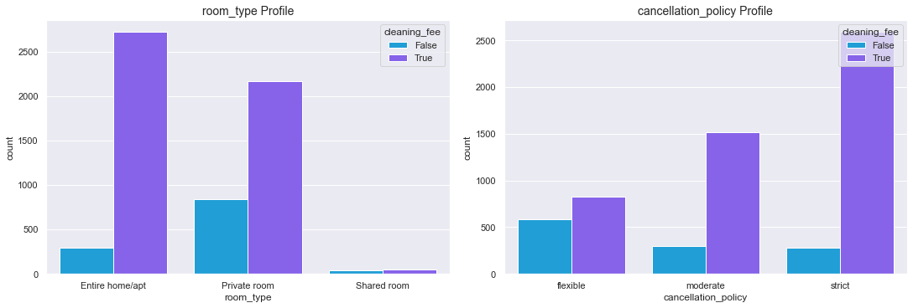
    


    
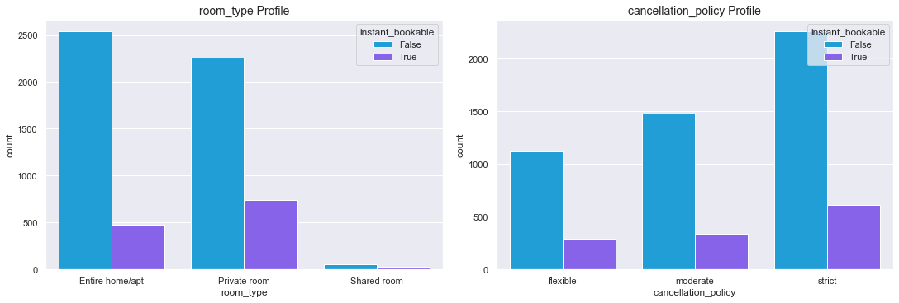
    


```python
info(main_data)
```


<style  type="text/css" >
#T_8e11e_row0_col2,#T_8e11e_row1_col2,#T_8e11e_row2_col2,#T_8e11e_row3_col2,#T_8e11e_row4_col2,#T_8e11e_row5_col2,#T_8e11e_row6_col2,#T_8e11e_row7_col2,#T_8e11e_row8_col2,#T_8e11e_row9_col2{
            background-color:  #f3f0f0;
            color:  #000000;
        }</style><table id="T_8e11e_" ><thead>    <tr>        <th class="blank level0" ></th>        <th class="col_heading level0 col0" >Nulls</th>        <th class="col_heading level0 col1" >Non-Nulls</th>        <th class="col_heading level0 col2" >Nulls %</th>        <th class="col_heading level0 col3" >Type</th>    </tr></thead><tbody>
                <tr>
                        <th id="T_8e11e_level0_row0" class="row_heading level0 row0" >accommodates</th>
                        <td id="T_8e11e_row0_col0" class="data row0 col0" >0</td>
                        <td id="T_8e11e_row0_col1" class="data row0 col1" >6097</td>
                        <td id="T_8e11e_row0_col2" class="data row0 col2" >0.00%</td>
                        <td id="T_8e11e_row0_col3" class="data row0 col3" >float64</td>
            </tr>
            <tr>
                        <th id="T_8e11e_level0_row1" class="row_heading level0 row1" >bathrooms</th>
                        <td id="T_8e11e_row1_col0" class="data row1 col0" >0</td>
                        <td id="T_8e11e_row1_col1" class="data row1 col1" >6097</td>
                        <td id="T_8e11e_row1_col2" class="data row1 col2" >0.00%</td>
                        <td id="T_8e11e_row1_col3" class="data row1 col3" >float64</td>
            </tr>
            <tr>
                        <th id="T_8e11e_level0_row2" class="row_heading level0 row2" >bedrooms</th>
                        <td id="T_8e11e_row2_col0" class="data row2 col0" >0</td>
                        <td id="T_8e11e_row2_col1" class="data row2 col1" >6097</td>
                        <td id="T_8e11e_row2_col2" class="data row2 col2" >0.00%</td>
                        <td id="T_8e11e_row2_col3" class="data row2 col3" >float64</td>
            </tr>
            <tr>
                        <th id="T_8e11e_level0_row3" class="row_heading level0 row3" >beds</th>
                        <td id="T_8e11e_row3_col0" class="data row3 col0" >0</td>
                        <td id="T_8e11e_row3_col1" class="data row3 col1" >6097</td>
                        <td id="T_8e11e_row3_col2" class="data row3 col2" >0.00%</td>
                        <td id="T_8e11e_row3_col3" class="data row3 col3" >float64</td>
            </tr>
            <tr>
                        <th id="T_8e11e_level0_row4" class="row_heading level0 row4" >cancellation_policy</th>
                        <td id="T_8e11e_row4_col0" class="data row4 col0" >0</td>
                        <td id="T_8e11e_row4_col1" class="data row4 col1" >6097</td>
                        <td id="T_8e11e_row4_col2" class="data row4 col2" >0.00%</td>
                        <td id="T_8e11e_row4_col3" class="data row4 col3" >category</td>
            </tr>
            <tr>
                        <th id="T_8e11e_level0_row5" class="row_heading level0 row5" >cleaning_fee</th>
                        <td id="T_8e11e_row5_col0" class="data row5 col0" >0</td>
                        <td id="T_8e11e_row5_col1" class="data row5 col1" >6097</td>
                        <td id="T_8e11e_row5_col2" class="data row5 col2" >0.00%</td>
                        <td id="T_8e11e_row5_col3" class="data row5 col3" >bool</td>
            </tr>
            <tr>
                        <th id="T_8e11e_level0_row6" class="row_heading level0 row6" >instant_bookable</th>
                        <td id="T_8e11e_row6_col0" class="data row6 col0" >0</td>
                        <td id="T_8e11e_row6_col1" class="data row6 col1" >6097</td>
                        <td id="T_8e11e_row6_col2" class="data row6 col2" >0.00%</td>
                        <td id="T_8e11e_row6_col3" class="data row6 col3" >bool</td>
            </tr>
            <tr>
                        <th id="T_8e11e_level0_row7" class="row_heading level0 row7" >log_price</th>
                        <td id="T_8e11e_row7_col0" class="data row7 col0" >0</td>
                        <td id="T_8e11e_row7_col1" class="data row7 col1" >6097</td>
                        <td id="T_8e11e_row7_col2" class="data row7 col2" >0.00%</td>
                        <td id="T_8e11e_row7_col3" class="data row7 col3" >float64</td>
            </tr>
            <tr>
                        <th id="T_8e11e_level0_row8" class="row_heading level0 row8" >review_scores_rating</th>
                        <td id="T_8e11e_row8_col0" class="data row8 col0" >0</td>
                        <td id="T_8e11e_row8_col1" class="data row8 col1" >6097</td>
                        <td id="T_8e11e_row8_col2" class="data row8 col2" >0.00%</td>
                        <td id="T_8e11e_row8_col3" class="data row8 col3" >float64</td>
            </tr>
            <tr>
                        <th id="T_8e11e_level0_row9" class="row_heading level0 row9" >room_type</th>
                        <td id="T_8e11e_row9_col0" class="data row9 col0" >0</td>
                        <td id="T_8e11e_row9_col1" class="data row9 col1" >6097</td>
                        <td id="T_8e11e_row9_col2" class="data row9 col2" >0.00%</td>
                        <td id="T_8e11e_row9_col3" class="data row9 col3" >category</td>
            </tr>
    </tbody></table>


```python
main_data.describe(include="all").T
```


<div>
<style scoped>
    .dataframe tbody tr th:only-of-type {
        vertical-align: middle;
    }

    .dataframe tbody tr th {
        vertical-align: top;
    }

    .dataframe thead th {
        text-align: right;
    }
</style>
<table border="1" class="dataframe">
  <thead>
    <tr style="text-align: right;">
      <th></th>
      <th>count</th>
      <th>unique</th>
      <th>top</th>
      <th>freq</th>
      <th>mean</th>
      <th>std</th>
      <th>min</th>
      <th>25%</th>
      <th>50%</th>
      <th>75%</th>
      <th>max</th>
    </tr>
  </thead>
  <tbody>
    <tr>
      <th>room_type</th>
      <td>6097</td>
      <td>3</td>
      <td>Entire home/apt</td>
      <td>3011</td>
      <td>NaN</td>
      <td>NaN</td>
      <td>NaN</td>
      <td>NaN</td>
      <td>NaN</td>
      <td>NaN</td>
      <td>NaN</td>
    </tr>
    <tr>
      <th>accommodates</th>
      <td>6097.0</td>
      <td>NaN</td>
      <td>NaN</td>
      <td>NaN</td>
      <td>2.430704</td>
      <td>1.145642</td>
      <td>1.0</td>
      <td>2.0</td>
      <td>2.0</td>
      <td>3.0</td>
      <td>16.0</td>
    </tr>
    <tr>
      <th>bathrooms</th>
      <td>6097.0</td>
      <td>NaN</td>
      <td>NaN</td>
      <td>NaN</td>
      <td>1.074381</td>
      <td>0.29722</td>
      <td>0.0</td>
      <td>1.0</td>
      <td>1.0</td>
      <td>1.0</td>
      <td>8.0</td>
    </tr>
    <tr>
      <th>cancellation_policy</th>
      <td>6097</td>
      <td>3</td>
      <td>strict</td>
      <td>2871</td>
      <td>NaN</td>
      <td>NaN</td>
      <td>NaN</td>
      <td>NaN</td>
      <td>NaN</td>
      <td>NaN</td>
      <td>NaN</td>
    </tr>
    <tr>
      <th>cleaning_fee</th>
      <td>6097</td>
      <td>2</td>
      <td>True</td>
      <td>4929</td>
      <td>NaN</td>
      <td>NaN</td>
      <td>NaN</td>
      <td>NaN</td>
      <td>NaN</td>
      <td>NaN</td>
      <td>NaN</td>
    </tr>
    <tr>
      <th>instant_bookable</th>
      <td>6097</td>
      <td>2</td>
      <td>False</td>
      <td>4858</td>
      <td>NaN</td>
      <td>NaN</td>
      <td>NaN</td>
      <td>NaN</td>
      <td>NaN</td>
      <td>NaN</td>
      <td>NaN</td>
    </tr>
    <tr>
      <th>review_scores_rating</th>
      <td>6097.0</td>
      <td>NaN</td>
      <td>NaN</td>
      <td>NaN</td>
      <td>95.80105</td>
      <td>5.321915</td>
      <td>40.0</td>
      <td>94.0</td>
      <td>97.0</td>
      <td>100.0</td>
      <td>100.0</td>
    </tr>
    <tr>
      <th>bedrooms</th>
      <td>6097.0</td>
      <td>NaN</td>
      <td>NaN</td>
      <td>NaN</td>
      <td>1.019846</td>
      <td>0.485789</td>
      <td>0.0</td>
      <td>1.0</td>
      <td>1.0</td>
      <td>1.0</td>
      <td>4.0</td>
    </tr>
    <tr>
      <th>beds</th>
      <td>6097.0</td>
      <td>NaN</td>
      <td>NaN</td>
      <td>NaN</td>
      <td>1.272101</td>
      <td>0.597126</td>
      <td>1.0</td>
      <td>1.0</td>
      <td>1.0</td>
      <td>1.0</td>
      <td>10.0</td>
    </tr>
    <tr>
      <th>log_price</th>
      <td>6097.0</td>
      <td>NaN</td>
      <td>NaN</td>
      <td>NaN</td>
      <td>4.612726</td>
      <td>0.535596</td>
      <td>2.70805</td>
      <td>4.248495</td>
      <td>4.59512</td>
      <td>5.003946</td>
      <td>7.090077</td>
    </tr>
  </tbody>
</table>
</div>


```python
main_data.describe(include=["bool"]).T
```


<div>
<style scoped>
    .dataframe tbody tr th:only-of-type {
        vertical-align: middle;
    }

    .dataframe tbody tr th {
        vertical-align: top;
    }

    .dataframe thead th {
        text-align: right;
    }
</style>
<table border="1" class="dataframe">
  <thead>
    <tr style="text-align: right;">
      <th></th>
      <th>count</th>
      <th>unique</th>
      <th>top</th>
      <th>freq</th>
    </tr>
  </thead>
  <tbody>
    <tr>
      <th>cleaning_fee</th>
      <td>6097</td>
      <td>2</td>
      <td>True</td>
      <td>4929</td>
    </tr>
    <tr>
      <th>instant_bookable</th>
      <td>6097</td>
      <td>2</td>
      <td>False</td>
      <td>4858</td>
    </tr>
  </tbody>
</table>
</div>


```python
'''
Input:
Axis, column name/x-axis, hue name

Output:
Displays a count plot.

Retunrs:
N/A
''' 
def HistBoxplot(box_chart_ax, hist_chart_ax, x_axis):
    sns.boxplot(
        data=main_data,
        x=main_data[x_axis],
        showmeans=True,
        ax=box_chart_ax)
    
    sns.histplot(
        data=main_data,
        x=main_data[x_axis],
        kde=True,
        ax=hist_chart_ax)
    
    hist_chart_ax.axvline(main_data[x_axis].mean(),                 # Get the mean of the values in the given column and draw a vertical line that cuts the chart on the mean value 
               color=stats_colors['Mean'],                                  # Use on of the colors predefined on this notebook
               label='Mean',                                                # Set the label to be diplayed on the legend
               linestyle="dashed");                                         # Make the line have dashes
    
    hist_chart_ax.axvline(main_data[x_axis].median(),               # Plot the median line on the chart.
               color=stats_colors['Median'],                                # Use on of the colors predefined on this notebook
               label='Median',                                              # Set the label to be diplayed on the legend
               linestyle="dashed");                                         # Make the line have dashes
    
    hist_chart_ax.axvline(main_data[x_axis].mode()[0],              # Plot the mode line on the chart.
               color=stats_colors['Mode'],                                  # Use on of the colors predefined on this notebook 
               label='Mode',                                                # Set the label to be diplayed on the legend
               linestyle="dashed");                                         # Make the line have dashes
    
    hist_chart_ax.legend(loc='upper right')

```


```python
def PlotHistBoxGrid():
    col_names = main_data.select_dtypes(include=['float', 'int']).columns.tolist()
    print(col_names)

    col_index = 0
    for r in range(0, int(len(col_names)), 3):
        fig, (box, hist) = plt.subplots(
            nrows=2,                                                                # Number of rows of the grid
            ncols=3,                                                                # Number of columns of the grid.
            figsize=(15,4),
            gridspec_kw={"height_ratios" : (0.25,0.5)},
            constrained_layout=True)

        for index in range(0, 3):
            if col_index < int(len(col_names)):
                HistBoxplot(box.flat[index], hist.flat[index], col_names[col_index])
            col_index += 1
```


```python
PlotHistBoxGrid()
```

    ['accommodates', 'bathrooms', 'review_scores_rating', 'bedrooms', 'beds', 'log_price']
    


    
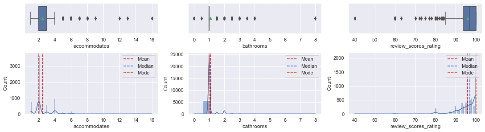
    


    
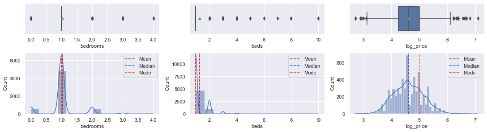
    


```python
sns.pairplot(data=main_data, kind="reg")
```


    <seaborn.axisgrid.PairGrid at 0x1eaa86c31f0>


    
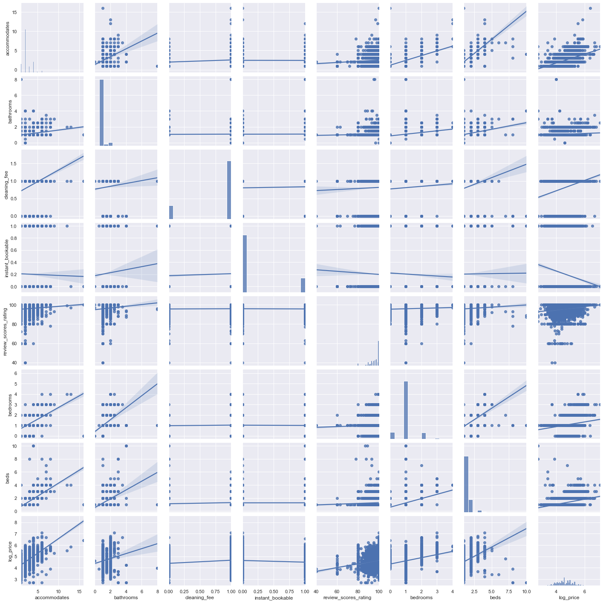
    


<ul>
    <li>The following columns are highly skewed and a lot of outliers, and might cause issues with the model: 'accommodates', 'bathrooms', 'review_scores_rating',  and 'beds'</li>
</ul>

<ul>
    <li>Convert categorial columns to number to help prepare for model building.</li>
    <li>Delete one  extra dummy columns for each category.</li>
</ul>


```python
main_data = pd.get_dummies(main_data, columns=['room_type', 'cancellation_policy'])
main_data.drop(['room_type_Shared room', 'cancellation_policy_strict'], inplace=True, axis = 1)
main_data.head()
```


<div>
<style scoped>
    .dataframe tbody tr th:only-of-type {
        vertical-align: middle;
    }

    .dataframe tbody tr th {
        vertical-align: top;
    }

    .dataframe thead th {
        text-align: right;
    }
</style>
<table border="1" class="dataframe">
  <thead>
    <tr style="text-align: right;">
      <th></th>
      <th>accommodates</th>
      <th>bathrooms</th>
      <th>cleaning_fee</th>
      <th>instant_bookable</th>
      <th>review_scores_rating</th>
      <th>bedrooms</th>
      <th>beds</th>
      <th>log_price</th>
      <th>room_type_Entire home/apt</th>
      <th>room_type_Private room</th>
      <th>cancellation_policy_flexible</th>
      <th>cancellation_policy_moderate</th>
    </tr>
  </thead>
  <tbody>
    <tr>
      <th>0</th>
      <td>3.0</td>
      <td>1.0</td>
      <td>True</td>
      <td>False</td>
      <td>100.0</td>
      <td>1.0</td>
      <td>1.0</td>
      <td>5.010635</td>
      <td>1</td>
      <td>0</td>
      <td>0</td>
      <td>0</td>
    </tr>
    <tr>
      <th>5</th>
      <td>2.0</td>
      <td>1.0</td>
      <td>True</td>
      <td>True</td>
      <td>100.0</td>
      <td>1.0</td>
      <td>1.0</td>
      <td>4.442651</td>
      <td>0</td>
      <td>1</td>
      <td>0</td>
      <td>0</td>
    </tr>
    <tr>
      <th>7</th>
      <td>2.0</td>
      <td>1.0</td>
      <td>True</td>
      <td>False</td>
      <td>93.0</td>
      <td>1.0</td>
      <td>1.0</td>
      <td>4.787492</td>
      <td>1</td>
      <td>0</td>
      <td>0</td>
      <td>1</td>
    </tr>
    <tr>
      <th>8</th>
      <td>2.0</td>
      <td>1.0</td>
      <td>True</td>
      <td>False</td>
      <td>99.0</td>
      <td>1.0</td>
      <td>1.0</td>
      <td>4.787492</td>
      <td>0</td>
      <td>1</td>
      <td>0</td>
      <td>1</td>
    </tr>
    <tr>
      <th>9</th>
      <td>2.0</td>
      <td>1.0</td>
      <td>True</td>
      <td>True</td>
      <td>90.0</td>
      <td>1.0</td>
      <td>1.0</td>
      <td>3.583519</td>
      <td>0</td>
      <td>1</td>
      <td>0</td>
      <td>1</td>
    </tr>
  </tbody>
</table>
</div>


####  <span style="font-family: Arial; font-weight:bold;font-size:1.9em;color:#0e92ea"> 3. Outlier Treatment:


```python
'''
Input:
Column name

Output:
A series containing interquatile range values

Retunrs:
A series containing interquatile range values
''' 
def Get_IQR(col_name):
    quartiles = np.quantile(main_data[col_name][main_data[col_name].notnull()], [.2, .75])
    power_4iqr = 4 * (quartiles[1] - quartiles[0])
    print(f'Q1 = {quartiles[0]}, Q3 = {quartiles[1]}, 4*IQR = {power_4iqr}')
    outlier_powers = main_data.loc[np.abs(main_data[col_name] - main_data[col_name].median()) > power_4iqr, col_name]
    print(outlier_powers.array) 
    
    return quartiles
```

<ul>
    <li>Replace outliers with median.</li>
</ul>


```python
col_names = ['accommodates', 'bathrooms', 'review_scores_rating']

for col_name in col_names:
    print(f"\n\n==========================={col_name}====================\n")
    main_data[col_name] = np.where(
        main_data[col_name] < Get_IQR(col_name)[0],
        main_data[col_name].median(),
        main_data[col_name])
    print(f"\n\n==========================={col_name}====================\n")
```

    
    
    ===========================accommodates====================
    
    Q1 = 2.0, Q3 = 3.0, 4*IQR = 4.0
    <PandasArray>
    [ 7.0, 16.0,  7.0,  8.0,  7.0,  8.0, 12.0,  7.0,  7.0,  7.0,  8.0,  8.0,  7.0,
      8.0,  7.0,  8.0,  8.0,  8.0,  9.0,  7.0, 13.0,  8.0]
    Length: 22, dtype: float64
    
    
    ===========================accommodates====================
    
    
    
    ===========================bathrooms====================
    
    Q1 = 1.0, Q3 = 1.0, 4*IQR = 0.0
    <PandasArray>
    [2.0, 2.0, 1.5, 2.0, 4.0, 1.5, 1.5, 2.0, 2.0, 2.0,
     ...
     1.5, 3.0, 2.0, 2.0, 1.5, 2.0, 2.0, 2.0, 1.5, 2.0]
    Length: 486, dtype: float64
    
    
    ===========================bathrooms====================
    
    
    
    ===========================review_scores_rating====================
    
    Q1 = 93.0, Q3 = 100.0, 4*IQR = 28.0
    <PandasArray>
    [60.0, 60.0, 40.0, 60.0, 60.0, 60.0, 60.0, 60.0, 60.0, 60.0, 60.0, 60.0, 60.0,
     60.0, 60.0, 40.0, 60.0, 60.0, 60.0, 60.0, 60.0, 63.0, 60.0]
    Length: 23, dtype: float64
    
    
    ===========================review_scores_rating====================
    
    


```python
PlotHistBoxGrid()
```

    ['accommodates', 'bathrooms', 'review_scores_rating', 'bedrooms', 'beds', 'log_price']
    


    

    


    

    


```python
main_data['review_scores_rating_log'] = np.log(main_data['review_scores_rating'])
sns.distplot(main_data["review_scores_rating_log"])
```


    <AxesSubplot:xlabel='review_scores_rating_log', ylabel='Density'>


    
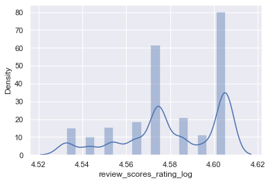
    


```python
sns.histplot(data=main_data, x="beds")
```


    <AxesSubplot:xlabel='beds', ylabel='Count'>


    
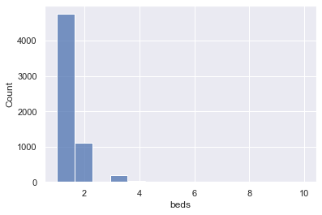
    


```python
main_data['accommodates'] = np.log(main_data['accommodates'])
sns.distplot(main_data["accommodates"])
```


    <AxesSubplot:xlabel='accommodates', ylabel='Density'>


    
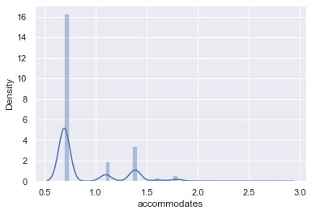
    


```python
sns.histplot(data=main_data, x="bathrooms")
```


    <AxesSubplot:xlabel='bathrooms', ylabel='Count'>


    
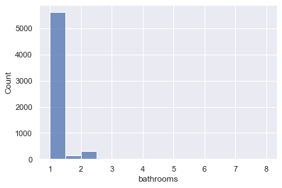
    


```python
PlotHistBoxGrid()
```

    ['accommodates', 'bathrooms', 'review_scores_rating', 'bedrooms', 'beds', 'log_price', 'review_scores_rating_log']
    


    
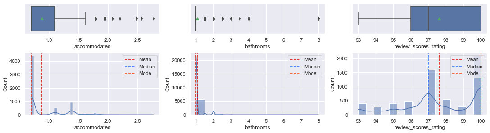
    


    

    


    
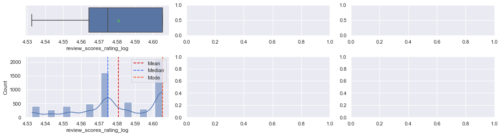
    


<ul>
    <li>Review the corrolation between the variables and delete variables</li>
    <li>There isnt any strong corrolation to the log_price and this wil affect the accuracy of the model.</li>
</ul>


```python
fig, ax = plt.subplots(figsize=(18,18)) 
sns.heatmap(data=main_data.corr(), annot=True, linewidths=.5, ax=ax)
plt.show()
```


    
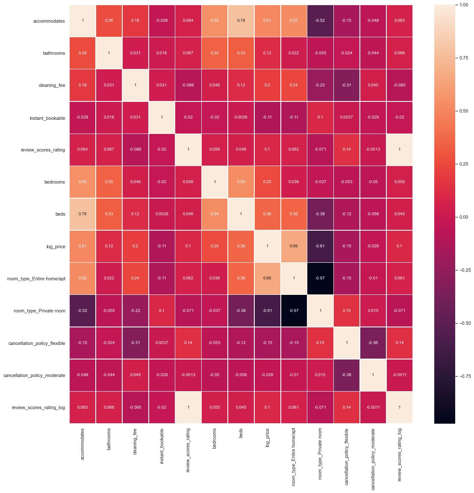
    


```python
info(main_data)
```


<style  type="text/css" >
#T_eb104_row0_col2,#T_eb104_row1_col2,#T_eb104_row2_col2,#T_eb104_row3_col2,#T_eb104_row4_col2,#T_eb104_row5_col2,#T_eb104_row6_col2,#T_eb104_row7_col2,#T_eb104_row8_col2,#T_eb104_row9_col2,#T_eb104_row10_col2,#T_eb104_row11_col2,#T_eb104_row12_col2{
            background-color:  #f3f0f0;
            color:  #000000;
        }</style><table id="T_eb104_" ><thead>    <tr>        <th class="blank level0" ></th>        <th class="col_heading level0 col0" >Nulls</th>        <th class="col_heading level0 col1" >Non-Nulls</th>        <th class="col_heading level0 col2" >Nulls %</th>        <th class="col_heading level0 col3" >Type</th>    </tr></thead><tbody>
                <tr>
                        <th id="T_eb104_level0_row0" class="row_heading level0 row0" >accommodates</th>
                        <td id="T_eb104_row0_col0" class="data row0 col0" >0</td>
                        <td id="T_eb104_row0_col1" class="data row0 col1" >6097</td>
                        <td id="T_eb104_row0_col2" class="data row0 col2" >0.00%</td>
                        <td id="T_eb104_row0_col3" class="data row0 col3" >float64</td>
            </tr>
            <tr>
                        <th id="T_eb104_level0_row1" class="row_heading level0 row1" >bathrooms</th>
                        <td id="T_eb104_row1_col0" class="data row1 col0" >0</td>
                        <td id="T_eb104_row1_col1" class="data row1 col1" >6097</td>
                        <td id="T_eb104_row1_col2" class="data row1 col2" >0.00%</td>
                        <td id="T_eb104_row1_col3" class="data row1 col3" >float64</td>
            </tr>
            <tr>
                        <th id="T_eb104_level0_row2" class="row_heading level0 row2" >bedrooms</th>
                        <td id="T_eb104_row2_col0" class="data row2 col0" >0</td>
                        <td id="T_eb104_row2_col1" class="data row2 col1" >6097</td>
                        <td id="T_eb104_row2_col2" class="data row2 col2" >0.00%</td>
                        <td id="T_eb104_row2_col3" class="data row2 col3" >float64</td>
            </tr>
            <tr>
                        <th id="T_eb104_level0_row3" class="row_heading level0 row3" >beds</th>
                        <td id="T_eb104_row3_col0" class="data row3 col0" >0</td>
                        <td id="T_eb104_row3_col1" class="data row3 col1" >6097</td>
                        <td id="T_eb104_row3_col2" class="data row3 col2" >0.00%</td>
                        <td id="T_eb104_row3_col3" class="data row3 col3" >float64</td>
            </tr>
            <tr>
                        <th id="T_eb104_level0_row4" class="row_heading level0 row4" >cancellation_policy_flexible</th>
                        <td id="T_eb104_row4_col0" class="data row4 col0" >0</td>
                        <td id="T_eb104_row4_col1" class="data row4 col1" >6097</td>
                        <td id="T_eb104_row4_col2" class="data row4 col2" >0.00%</td>
                        <td id="T_eb104_row4_col3" class="data row4 col3" >uint8</td>
            </tr>
            <tr>
                        <th id="T_eb104_level0_row5" class="row_heading level0 row5" >cancellation_policy_moderate</th>
                        <td id="T_eb104_row5_col0" class="data row5 col0" >0</td>
                        <td id="T_eb104_row5_col1" class="data row5 col1" >6097</td>
                        <td id="T_eb104_row5_col2" class="data row5 col2" >0.00%</td>
                        <td id="T_eb104_row5_col3" class="data row5 col3" >uint8</td>
            </tr>
            <tr>
                        <th id="T_eb104_level0_row6" class="row_heading level0 row6" >cleaning_fee</th>
                        <td id="T_eb104_row6_col0" class="data row6 col0" >0</td>
                        <td id="T_eb104_row6_col1" class="data row6 col1" >6097</td>
                        <td id="T_eb104_row6_col2" class="data row6 col2" >0.00%</td>
                        <td id="T_eb104_row6_col3" class="data row6 col3" >bool</td>
            </tr>
            <tr>
                        <th id="T_eb104_level0_row7" class="row_heading level0 row7" >instant_bookable</th>
                        <td id="T_eb104_row7_col0" class="data row7 col0" >0</td>
                        <td id="T_eb104_row7_col1" class="data row7 col1" >6097</td>
                        <td id="T_eb104_row7_col2" class="data row7 col2" >0.00%</td>
                        <td id="T_eb104_row7_col3" class="data row7 col3" >bool</td>
            </tr>
            <tr>
                        <th id="T_eb104_level0_row8" class="row_heading level0 row8" >log_price</th>
                        <td id="T_eb104_row8_col0" class="data row8 col0" >0</td>
                        <td id="T_eb104_row8_col1" class="data row8 col1" >6097</td>
                        <td id="T_eb104_row8_col2" class="data row8 col2" >0.00%</td>
                        <td id="T_eb104_row8_col3" class="data row8 col3" >float64</td>
            </tr>
            <tr>
                        <th id="T_eb104_level0_row9" class="row_heading level0 row9" >review_scores_rating</th>
                        <td id="T_eb104_row9_col0" class="data row9 col0" >0</td>
                        <td id="T_eb104_row9_col1" class="data row9 col1" >6097</td>
                        <td id="T_eb104_row9_col2" class="data row9 col2" >0.00%</td>
                        <td id="T_eb104_row9_col3" class="data row9 col3" >float64</td>
            </tr>
            <tr>
                        <th id="T_eb104_level0_row10" class="row_heading level0 row10" >review_scores_rating_log</th>
                        <td id="T_eb104_row10_col0" class="data row10 col0" >0</td>
                        <td id="T_eb104_row10_col1" class="data row10 col1" >6097</td>
                        <td id="T_eb104_row10_col2" class="data row10 col2" >0.00%</td>
                        <td id="T_eb104_row10_col3" class="data row10 col3" >float64</td>
            </tr>
            <tr>
                        <th id="T_eb104_level0_row11" class="row_heading level0 row11" >room_type_Entire home/apt</th>
                        <td id="T_eb104_row11_col0" class="data row11 col0" >0</td>
                        <td id="T_eb104_row11_col1" class="data row11 col1" >6097</td>
                        <td id="T_eb104_row11_col2" class="data row11 col2" >0.00%</td>
                        <td id="T_eb104_row11_col3" class="data row11 col3" >uint8</td>
            </tr>
            <tr>
                        <th id="T_eb104_level0_row12" class="row_heading level0 row12" >room_type_Private room</th>
                        <td id="T_eb104_row12_col0" class="data row12 col0" >0</td>
                        <td id="T_eb104_row12_col1" class="data row12 col1" >6097</td>
                        <td id="T_eb104_row12_col2" class="data row12 col2" >0.00%</td>
                        <td id="T_eb104_row12_col3" class="data row12 col3" >uint8</td>
            </tr>
    </tbody></table>


####  <span style="font-family: Arial; font-weight:bold;font-size:1.9em;color:#0e92ea"> 4. Model Building and Evaluation


```python
Y = main_data['log_price']
X = main_data.drop(['log_price'], axis=1, inplace=False)
```


```python
X = pd.get_dummies(
    X,
    columns=X.select_dtypes(include=["object", "category"]).columns.tolist(),
    drop_first=True,
)

X.head()
```


<div>
<style scoped>
    .dataframe tbody tr th:only-of-type {
        vertical-align: middle;
    }

    .dataframe tbody tr th {
        vertical-align: top;
    }

    .dataframe thead th {
        text-align: right;
    }
</style>
<table border="1" class="dataframe">
  <thead>
    <tr style="text-align: right;">
      <th></th>
      <th>accommodates</th>
      <th>bathrooms</th>
      <th>cleaning_fee</th>
      <th>instant_bookable</th>
      <th>review_scores_rating</th>
      <th>bedrooms</th>
      <th>beds</th>
      <th>room_type_Entire home/apt</th>
      <th>room_type_Private room</th>
      <th>cancellation_policy_flexible</th>
      <th>cancellation_policy_moderate</th>
      <th>review_scores_rating_log</th>
    </tr>
  </thead>
  <tbody>
    <tr>
      <th>0</th>
      <td>1.098612</td>
      <td>1.0</td>
      <td>True</td>
      <td>False</td>
      <td>100.0</td>
      <td>1.0</td>
      <td>1.0</td>
      <td>1</td>
      <td>0</td>
      <td>0</td>
      <td>0</td>
      <td>4.605170</td>
    </tr>
    <tr>
      <th>5</th>
      <td>0.693147</td>
      <td>1.0</td>
      <td>True</td>
      <td>True</td>
      <td>100.0</td>
      <td>1.0</td>
      <td>1.0</td>
      <td>0</td>
      <td>1</td>
      <td>0</td>
      <td>0</td>
      <td>4.605170</td>
    </tr>
    <tr>
      <th>7</th>
      <td>0.693147</td>
      <td>1.0</td>
      <td>True</td>
      <td>False</td>
      <td>93.0</td>
      <td>1.0</td>
      <td>1.0</td>
      <td>1</td>
      <td>0</td>
      <td>0</td>
      <td>1</td>
      <td>4.532599</td>
    </tr>
    <tr>
      <th>8</th>
      <td>0.693147</td>
      <td>1.0</td>
      <td>True</td>
      <td>False</td>
      <td>99.0</td>
      <td>1.0</td>
      <td>1.0</td>
      <td>0</td>
      <td>1</td>
      <td>0</td>
      <td>1</td>
      <td>4.595120</td>
    </tr>
    <tr>
      <th>9</th>
      <td>0.693147</td>
      <td>1.0</td>
      <td>True</td>
      <td>True</td>
      <td>97.0</td>
      <td>1.0</td>
      <td>1.0</td>
      <td>0</td>
      <td>1</td>
      <td>0</td>
      <td>1</td>
      <td>4.574711</td>
    </tr>
  </tbody>
</table>
</div>


```python
x_train, x_test, y_train, y_test = train_test_split(X, Y, test_size=0.3, random_state=1)
```


```python
linear_reg_model = LinearRegression()
linear_reg_model.fit(x_train, y_train)
```


    LinearRegression()


```python
coefs = pd.DataFrame(
    np.append(linear_reg_model.coef_, linear_reg_model.intercept_),
    index=x_train.columns.tolist() + ["Intercept"],
    columns=["Coefficients"],
)
```


```python
coefs.sort_values('Coefficients')
```


<div>
<style scoped>
    .dataframe tbody tr th:only-of-type {
        vertical-align: middle;
    }

    .dataframe tbody tr th {
        vertical-align: top;
    }

    .dataframe thead th {
        text-align: right;
    }
</style>
<table border="1" class="dataframe">
  <thead>
    <tr style="text-align: right;">
      <th></th>
      <th>Coefficients</th>
    </tr>
  </thead>
  <tbody>
    <tr>
      <th>review_scores_rating_log</th>
      <td>-67.050527</td>
    </tr>
    <tr>
      <th>cancellation_policy_flexible</th>
      <td>-0.059220</td>
    </tr>
    <tr>
      <th>beds</th>
      <td>-0.047521</td>
    </tr>
    <tr>
      <th>instant_bookable</th>
      <td>-0.038330</td>
    </tr>
    <tr>
      <th>cancellation_policy_moderate</th>
      <td>-0.032453</td>
    </tr>
    <tr>
      <th>cleaning_fee</th>
      <td>0.013107</td>
    </tr>
    <tr>
      <th>bathrooms</th>
      <td>0.082607</td>
    </tr>
    <tr>
      <th>bedrooms</th>
      <td>0.180463</td>
    </tr>
    <tr>
      <th>accommodates</th>
      <td>0.231285</td>
    </tr>
    <tr>
      <th>room_type_Private room</th>
      <td>0.647776</td>
    </tr>
    <tr>
      <th>review_scores_rating</th>
      <td>0.706836</td>
    </tr>
    <tr>
      <th>room_type_Entire home/apt</th>
      <td>1.262139</td>
    </tr>
    <tr>
      <th>Intercept</th>
      <td>241.419938</td>
    </tr>
  </tbody>
</table>
</div>


<ul>
    <li>There isnt that much corrolation between the target price and the variables in the given columns, except for small variations noticed between price and room type (especially if it is Entire home/apt) and the number of people/adults the apartment can accomodate.</li>
    <li>We also notice a deccrease or low pricing for other apartment types that are not Entire home/apt and with any cancellation policy added.</li>
     <li>Apartment reviews and number or beds do very little to help with pricing</li>
    <li>Number of beds corrolates with accomodation but does very little to help the model predict the price and could be left out/dropped</li>
</ul>


```python
linear_reg_model.score(x_train, y_train)
```


    0.5327073328513621


```python
linear_reg_model.score(x_test, y_test)
```


    0.5045802943227238


```python
def Get_Adjusted_R_Squared(predictors, targets, predictions):
    r2 = r2_score(targets, predictions)
    n = predictors.shape[0]
    k = predictors.shape[1]
    return 1 - ((1 - r2)) * (n - 1) / (n - k -1)
    
def Model_Perf_Analysis(model, predictors, targets):
    predictions = model.predict(predictors)
    predictions = np.exp(predictions)
    targets = np.exp(targets)
    
    r_squred = r2_score(targets, predictions)
    adj_r_squred = Get_Adjusted_R_Squared(predictors, targets, predictions)
    root_mean_sqrd_error = np.sqrt(mean_squared_error(targets, predictions))
    mean_abs_error = mean_absolute_error(targets, predictions)
    mape_sqrd = np.mean(np.abs(targets - predictions) / targets) * 100
    
    df_perf = pd.DataFrame({
        "RMSE": root_mean_sqrd_error,
        "MAE": mean_abs_error,
        "R-Squared": r_squred,
        "Adj_R_Sqaured": adj_r_squred,
        "MAPE": mape_sqrd
    },
    index=[0])
    return df_perf
```


```python
perf_results = Model_Perf_Analysis(linear_reg_model, x_train, y_train)
perf_results
```


<div>
<style scoped>
    .dataframe tbody tr th:only-of-type {
        vertical-align: middle;
    }

    .dataframe tbody tr th {
        vertical-align: top;
    }

    .dataframe thead th {
        text-align: right;
    }
</style>
<table border="1" class="dataframe">
  <thead>
    <tr style="text-align: right;">
      <th></th>
      <th>RMSE</th>
      <th>MAE</th>
      <th>R-Squared</th>
      <th>Adj_R_Sqaured</th>
      <th>MAPE</th>
    </tr>
  </thead>
  <tbody>
    <tr>
      <th>0</th>
      <td>53.23185</td>
      <td>33.684581</td>
      <td>0.463586</td>
      <td>0.462073</td>
      <td>30.469584</td>
    </tr>
  </tbody>
</table>
</div>


```python
perf_results = Model_Perf_Analysis(linear_reg_model, x_test, y_test)
perf_results
```


<div>
<style scoped>
    .dataframe tbody tr th:only-of-type {
        vertical-align: middle;
    }

    .dataframe tbody tr th {
        vertical-align: top;
    }

    .dataframe thead th {
        text-align: right;
    }
</style>
<table border="1" class="dataframe">
  <thead>
    <tr style="text-align: right;">
      <th></th>
      <th>RMSE</th>
      <th>MAE</th>
      <th>R-Squared</th>
      <th>Adj_R_Sqaured</th>
      <th>MAPE</th>
    </tr>
  </thead>
  <tbody>
    <tr>
      <th>0</th>
      <td>52.517781</td>
      <td>33.821974</td>
      <td>0.431116</td>
      <td>0.427359</td>
      <td>30.013301</td>
    </tr>
  </tbody>
</table>
</div>


<ul>
        <li>The model accuracy and root mean square are considerably poor and this might be due to a very high variance in the attributes used to build the models and is not really helpful to have a 50% accurate model.
    </li>
</ul>

####  <span style="font-family: Arial; font-weight:bold;font-size:1.9em;color:#0e92ea"> 5. Conclusion

<ul>
    <li>There isnt that much corrolation between the target price and the variables in the given columns, except for small variations noticed between price and room type (especially if it is Entire home/apt) and the number of people/adults the apartment can accomodate.</li>
    <li>We also notice a deccrease or low pricing for other apartment types that are not Entire home/apt and with any cancellation policy added.</li>
     <li>Apartment reviews and number or beds do very little to help with pricing</li>
    <li>Number of beds corrolates with accomodation but does very little to help the model predict the price and could be left out/dropped</li>
</ul>


```python
os.system('jupyter nbconvert --to markdown --output "README.md" "AirBnB.ipynb"')
```


```python

```
